## *腾讯云LNMP 高可用架构与自动化运维*

### 图片是我之前在本地虚拟机内截图的，云上操作基本一致所以就不重新截图了

# 第一部分

### 第一阶段：基础环境准备（三台服务器都执行)

#### 1. 系统初始化

```
# 关闭 SELinux（生产环境建议配置策略而非关闭，此处为简化部署）
setenforce 0
sed -i 's/^SELINUX=enforcing/SELINUX=disabled/' /etc/selinux/config

# 配置主机名
# 在 10.1.0.5 执行：
hostnamectl set-hostname lb-server
# 在 10.1.4.16 执行：
hostnamectl set-hostname web1-server
# 在 10.1.4.5 执行：
hostnamectl set-hostname web2-server

# 配置 hosts（三台都执行）
cat >> /etc/hosts <<EOF
10.1.0.5 lb-server
10.1.4.16 web1-server
10.1.4.5 web2-server
EOF

# 关闭防火墙或开放必要端口（此处选择关闭防火墙简化，生产建议精细化开放）
systemctl stop firewalld
systemctl disable firewalld

# 更新系统
dnf update -y

# 安装基础工具
dnf install -y vim wget curl net-tools telnet bash-completion
```

#### 2. 时间同步

```
dnf install -y chrony
systemctl enable chronyd --now
timedatectl set-timezone Asia/Shanghai
```

### 第二阶段：Web1 (10.1.4.16) 部署 — NFS Server + DB Master + LNMP

#### 1. 安装 NFS Server

```
dnf install -y nfs-utils rpcbind

# 创建 WordPress 共享目录
mkdir -p /data/wordpress
chmod 755 /data/wordpress

# 配置 NFS 导出
cat > /etc/exports <<EOF
/data/wordpress 10.1.4.5(rw,sync,no_root_squash,no_all_squash)
EOF

# 启动服务
systemctl enable rpcbind nfs-server --now
exportfs -arv
```

#### 2. 安装 MySQL 8.0 (主库)

```
dnf install -y mysql-server mysql

# 启动并设置开机自启
systemctl enable mysqld --now

# 安全配置
mysql_secure_installation
# 按提示设置 root 密码，移除匿名用户，禁止远程 root 登录，移除 test 数据库，重新加载权限表

# 登录 MySQL 配置主从
mysql -u root -p
```

在 MySQL 中执行：

```
-- 创建 WordPress 数据库和用户
CREATE DATABASE wordpress CHARACTER SET utf8mb4 COLLATE utf8mb4_unicode_ci;
CREATE USER 'wpuser'@'%' IDENTIFIED WITH mysql_native_password BY 'YourStrongPassword123!';
GRANT ALL PRIVILEGES ON wordpress.* TO 'wpuser'@'%';
FLUSH PRIVILEGES;

-- 配置主库
CREATE USER 'repl'@'10.1.4.5' IDENTIFIED WITH mysql_native_password BY 'ReplStrongPassword456!';
GRANT REPLICATION SLAVE ON *.* TO 'repl'@'10.1.4.5';
FLUSH PRIVILEGES;

-- 查看主库状态，记录 File 和 Position
SHOW MASTER STATUS;
-- 示例输出：File: mysql-bin.000001, Position: 157
EXIT;
```

编辑 MySQL 主库配置：

```
cat > /etc/my.cnf.d/master.cnf <<EOF
[mysqld]
server-id=1
log-bin=mysql-bin
binlog-do-db=wordpress
innodb_flush_log_at_trx_commit=1
sync_binlog=1
EOF

systemctl restart mysqld
```

再次登录确认主库状态：

```
mysql -u root -p -e "SHOW MASTER STATUS;"
# 记录 File 和 Position，Web2 配置从库时需要用到
```

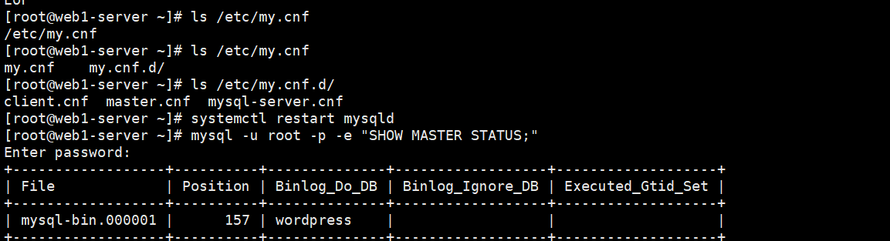

#### 3. 安装 LNMP 环境

```
# 安装 Nginx、PHP 8.1+、PHP-FPM 及必要扩展
dnf install -y nginx php php-fpm php-mysqlnd php-gd php-xml php-mbstring php-json php-curl php-zip php-opcache

# 配置 PHP-FPM
sed -i 's/^user = apache/user = nginx/' /etc/php-fpm.d/www.conf
sed -i 's/^group = apache/group = nginx/' /etc/php-fpm.d/www.conf
sed -i 's/^listen = .*/listen = 127.0.0.1:9000/' /etc/php-fpm.d/www.conf

systemctl enable nginx php-fpm --now
```

#### 4. 部署 WordPress

```
cd /tmp
wget https://wordpress.org/latest.tar.gz
tar -xzf latest.tar.gz
cp -r wordpress/* /data/wordpress/
chown -R nginx:nginx /data/wordpress
chmod -R 755 /data/wordpress

# 创建 WordPress 配置文件
cd /data/wordpress
cp wp-config-sample.php wp-config.php

# 编辑 wp-config.php
cat > wp-config.php <<EOF
<?php
define( 'DB_NAME', 'wordpress' );
define( 'DB_USER', 'wpuser' );
define( 'DB_PASSWORD', 'YourStrongPassword123!' );
define( 'DB_HOST', '10.1.4.16' );
define( 'DB_CHARSET', 'utf8mb4' );
define( 'DB_COLLATE', 'utf8mb4_unicode_ci' );

define('AUTH_KEY',         '$(openssl rand -base64 48)');
define('SECURE_AUTH_KEY',  '$(openssl rand -base64 48)');
define('LOGGED_IN_KEY',    '$(openssl rand -base64 48)');
define('NONCE_KEY',        '$(openssl rand -base64 48)');
define('AUTH_SALT',        '$(openssl rand -base64 48)');
define('SECURE_AUTH_SALT', '$(openssl rand -base64 48)');
define('LOGGED_IN_SALT',   '$(openssl rand -base64 48)');
define('NONCE_SALT',       '$(openssl rand -base64 48)');

\$table_prefix = 'wp_';

define( 'WP_DEBUG', false );

/* 多节点部署关键配置：使用共享 NFS 存储上传文件 */
define( 'WP_CONTENT_DIR', '/data/wordpress/wp-content' );
define( 'WP_CONTENT_URL', 'https://your-domain.com/wp-content' );

if ( ! defined( 'ABSPATH' ) ) {
    define( 'ABSPATH', __DIR__ . '/' );
}
require_once ABSPATH . 'wp-settings.php';
EOF
```

配置 Nginx 虚拟主机：

```
cat > /etc/nginx/conf.d/wordpress.conf <<EOF
server {
    listen 80;
    server_name 10.1.4.16;
    root /data/wordpress;
    index index.php index.html;

    location / {
        try_files \$uri \$uri/ /index.php?\$args;
    }

    location ~ \.php$ {
        fastcgi_pass 127.0.0.1:9000;
        fastcgi_index index.php;
        fastcgi_param SCRIPT_FILENAME \$document_root\$fastcgi_script_name;
        include fastcgi_params;
    }

    location ~ /\.ht {
        deny all;
    }

    location ~* \.(jpg|jpeg|png|gif|ico|css|js|svg)$ {
        expires 30d;
        add_header Cache-Control "public, immutable";
    }
}
EOF

# 测试配置并重启
nginx -t
systemctl restart nginx
```


### 第三阶段：Web2 (10.1.4.5) 部署 — NFS Client + DB Slave + LNMP

#### 1. 挂载 NFS 共享目录

```
dnf install -y nfs-utils

# 创建挂载点
mkdir -p /data/wordpress

# 配置开机自动挂载
cat >> /etc/fstab <<EOF
10.1.4.16:/data/wordpress /data/wordpress nfs defaults,_netdev 0 0
EOF

# 立即挂载
mount -a
df -h | grep wordpress
```

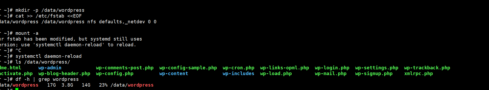

#### 2. 安装 MySQL 8.0 (从库)

```
dnf install -y mysql-server mysql
systemctl enable mysqld --now

mysql_secure_installation
```

编辑从库配置：

```
cat > /etc/my.cnf.d/slave.cnf <<EOF
[mysqld]
server-id=2
relay-log=mysql-relay-bin
log-bin=mysql-bin
read_only=1
replicate-do-db=wordpress
EOF

systemctl restart mysqld
```

配置主从同步（**注意替换为 Web1 上 `SHOW MASTER STATUS` 的实际值**）：

```
mysql -u root -p
CHANGE MASTER TO
    MASTER_HOST='10.1.4.16',
    MASTER_USER='repl',
    MASTER_PASSWORD='ReplStrongPassword456!',
    MASTER_LOG_FILE='mysql-bin.000001',   -- 替换为实际 File
    MASTER_LOG_POS=157;                   -- 替换为实际 Position

START SLAVE;
SHOW SLAVE STATUS\G
-- 确认 Slave_IO_Running: Yes 和 Slave_SQL_Running: Yes
EXIT;
```

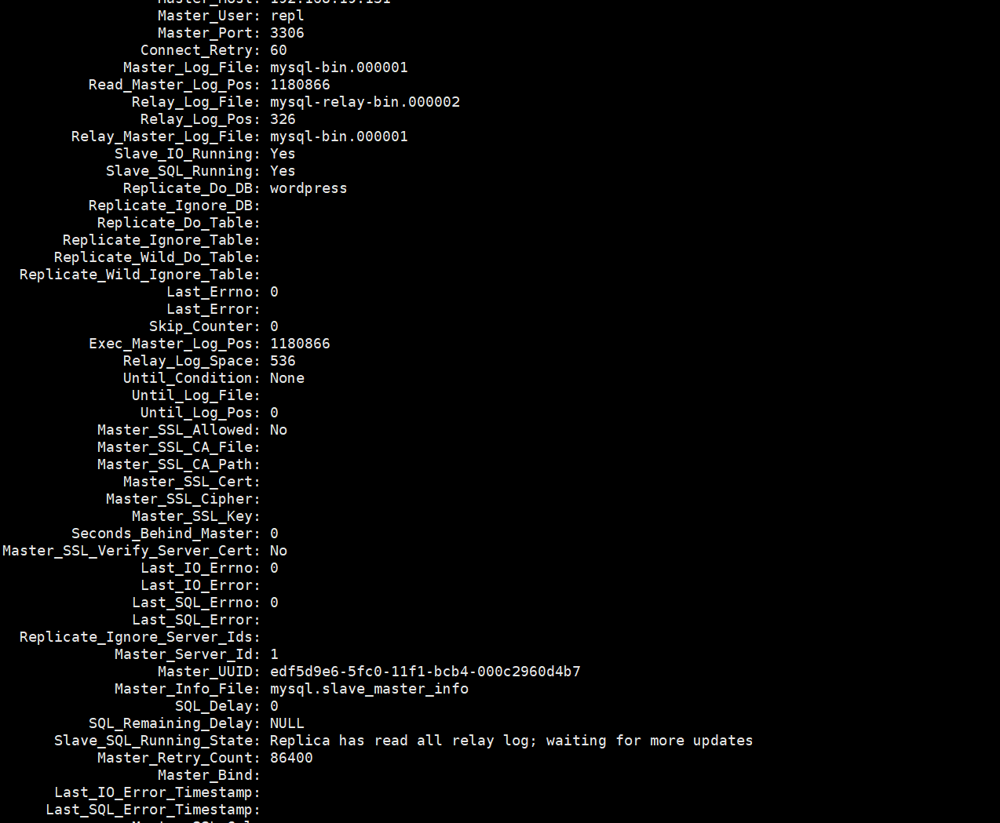

#### 3. 安装 LNMP 环境（与 Web1 相同）

```
dnf install -y nginx php php-fpm php-mysqlnd php-gd php-xml php-mbstring php-json php-curl php-zip php-opcache

sed -i 's/^user = apache/user = nginx/' /etc/php-fpm.d/www.conf
sed -i 's/^group = apache/group = nginx/' /etc/php-fpm.d/www.conf
sed -i 's/^listen = .*/listen = 127.0.0.1:9000/' /etc/php-fpm.d/www.conf

systemctl enable nginx php-fpm --now
```

#### 4. 配置 Nginx（使用 NFS 共享的 WordPress 文件）

```
cat > /etc/nginx/conf.d/wordpress.conf <<EOF
server {
    listen 80;
    server_name 10.1.4.5;
    root /data/wordpress;
    index index.php index.html;

    location / {
        try_files \$uri \$uri/ /index.php?\$args;
    }

    location ~ \.php$ {
        fastcgi_pass 127.0.0.1:9000;
        fastcgi_index index.php;
        fastcgi_param SCRIPT_FILENAME \$document_root\$fastcgi_script_name;
        include fastcgi_params;
    }

    location ~ /\.ht {
        deny all;
    }

    location ~* \.(jpg|jpeg|png|gif|ico|css|js|svg)$ {
        expires 30d;
        add_header Cache-Control "public, immutable";
    }
}
EOF

nginx -t
systemctl restart nginx
```

### 第四阶段：负载均衡器 (10.1.0.5) 部署

```
dnf install -y nginx

cat > /etc/nginx/nginx.conf <<EOF
user nginx;
worker_processes auto;
error_log /var/log/nginx/error.log notice;
pid /run/nginx.pid;

events {
    worker_connections 1024;
}

http {
    include /etc/nginx/mime.types;
    default_type application/octet-stream;

    log_format main '\$remote_addr - \$remote_user [\$time_local] "\$request" '
                    '\$status \$body_bytes_sent "\$http_referer" '
                    '"\$http_user_agent" "\$http_x_forwarded_for"';

    access_log /var/log/nginx/access.log main;

    sendfile on;
    tcp_nopush on;
    keepalive_timeout 65;
    gzip on;

    # 负载均衡 upstream
    upstream wordpress_backend {
        # 轮询算法（默认），可改为 least_conn 或 ip_hash
        server 10.1.4.16:80 weight=5 max_fails=3 fail_timeout=30s;
        server 10.1.4.5:80 weight=5 max_fails=3 fail_timeout=30s;
    }

    server {
        listen 80;
        server_name _;

        location / {
            proxy_pass http://wordpress_backend;
            proxy_set_header Host \$host;
            proxy_set_header X-Real-IP \$remote_addr;
            proxy_set_header X-Forwarded-For \$proxy_add_x_forwarded_for;
            proxy_set_header X-Forwarded-Proto \$scheme;

            # 超时设置
            proxy_connect_timeout 30s;
            proxy_send_timeout 30s;
            proxy_read_timeout 30s;
        }

        # 静态文件缓存（可选优化）
        location ~* \.(jpg|jpeg|png|gif|ico|css|js|svg|woff|woff2)$ {
            proxy_pass http://wordpress_backend;
            proxy_cache_valid 200 30d;
            expires 30d;
        }
    }
}
EOF

nginx -t
systemctl enable nginx --now
```

### 第五阶段：WordPress 初始化与验证

#### 1. 通过浏览器访问负载均衡器

打开浏览器访问 `http://10.1.0.5`，按向导完成 WordPress 安装。

#### 2. 验证 NFS 同步

在 Web1 或 Web2 任意一台上传媒体文件，检查另一台是否同步出现

#### 3. 验证 MySQL 主从复制

在 Web1（主库）插入测试数据：

```
mysql -u root -p -e "USE wordpress; SHOW TABLES;"
```

在 Web2（从库）验证：

```
mysql -u root -p -e "USE wordpress; SHOW TABLES;"
mysql -u root -p -e "SHOW SLAVE STATUS\G" | grep "Running"
```


在 **Web1 (10.1.4.16)** 或任意能连上 MySQL 主库的服务器执行：

```
USE wordpress;
UPDATE wp_options SET option_value = 'http://10.1.0.5' WHERE option_name = 'siteurl';
UPDATE wp_options SET option_value = 'http://10.1.0.5' WHERE option_name = 'home';
EXIT;
```

这样流量就会通过10.1.0.5统一进入


# 第二部分

### 架构调整

| 节点                | IP             | 角色                                 |
| ------------------- | -------------- | ------------------------------------ |
| **LB (反向代理)**   | 10.1.0.5 | Nginx 反向代理 → 仅转发给 Web1 (10.1.4.16) |
| **Web1 (被测节点)** | 10.1.4.16 | LNMP + WordPress（目标服务）         |
| **Web2 (压测节点)** | 10.1.4.5 | 压测工具 + 数据采集                  |

### 第一阶段：Web2 (10.1.4.5) 改造为压测节点

#### 1. 停止 Web2 上的 LNMP 相关服务（释放资源）

```
# 停止并禁用 LNMP 服务（保留 NFS 挂载和 MySQL 从库可选，但压测时建议释放 80 端口）
systemctl stop nginx php-fpm mysqld
systemctl disable nginx php-fpm mysqld

# 卸载 NFS（可选，释放资源）
umount /data/wordpress
sed -i '/10.1.4.16/d' /etc/fstab
```

#### 2. 安装压测工具集

```
# 基础工具
dnf install -y epel-release
dnf install -y vim wget curl net-tools telnet htop sysstat

# 安装 wrk（高性能 HTTP 压测）
dnf install -y wrk

# 安装 siege（多并发压测）
dnf install -y siege

# 安装 ab (Apache Bench，基准测试)
dnf install -y httpd-tools

# 安装 nload / iftop 网络监控
dnf install -y nload iftop

# 安装 dstat 全能监控
dnf install -y dstat
```

#### 3. 压测脚本准备

创建压测工作目录：

```
mkdir -p /opt/benchmark
cd /opt/benchmark
```

##### 脚本 A：wrk 高并发压测脚本

```
cat > /opt/benchmark/wrk_test.sh <<'EOF'
#!/bin/bash
# wrk 压测脚本 - 测试 LB  反向代理 Web1 的性能

TARGET="http://10.1.0.5"
DURATION=60
CONNECTIONS=(100 500 1000 2000 5000)
THREADS=4

echo "=== WRK Benchmark Start: $(date) ===" > /opt/benchmark/wrk_result.log
echo "Target: $TARGET" >> /opt/benchmark/wrk_result.log

for conn in "${CONNECTIONS[@]}"; do
    echo "" >> /opt/benchmark/wrk_result.log
    echo "--- Connections: $conn, Duration: ${DURATION}s ---" >> /opt/benchmark/wrk_result.log
    wrk -t${THREADS} -c${conn} -d${DURATION}s --latency ${TARGET}/ >> /opt/benchmark/wrk_result.log 2>&1
    sleep 10
done

echo "=== WRK Benchmark End: $(date) ===" >> /opt/benchmark/wrk_result.log
EOF
chmod +x /opt/benchmark/wrk_test.sh
```

##### 脚本 B：wrk 持续压力测试（制造 TIME_WAIT 和 502）

```
cat > /opt/benchmark/wrk_stress.sh <<'EOF'
#!/bin/bash
# 持续高压测试，专门用于暴露 TIME_WAIT 耗尽和 502 问题

TARGET="http://10.1.0.5"
DURATION=120
CONNECTIONS=10000
THREADS=8

echo "=== Stress Test Start: $(date) ===" > /opt/benchmark/stress_result.log
wrk -t${THREADS} -c${CONNECTIONS} -d${DURATION}s --latency ${TARGET}/ >> /opt/benchmark/stress_result.log 2>&1
echo "=== Stress Test End: $(date) ===" >> /opt/benchmark/stress_result.log
EOF
chmod +x /opt/benchmark/wrk_stress.sh
```

##### 脚本 C：502 错误率实时监控脚本

```
cat > /opt/benchmark/monitor_502.sh <<'EOF'
#!/bin/bash
TARGET="http://10.1.0.5"
echo "Time,Total_Requests,502_Count,502_Rate(%),Avg_Latency(ms)" > /opt/benchmark/502_monitor.csv

while true; do
    START=$(date +%s%N)
    RESULT=$(ab -n 1000 -c 500 -k ${TARGET}/ 2>&1)
    
    # 提取总请求数（兼容不同 ab 版本输出格式）
    TOTAL=$(echo "$RESULT" | grep -i "complete requests" | awk '{print $NF}')
    [ -z "$TOTAL" ] && TOTAL=$(echo "$RESULT" | grep -i "Complete requests" | awk '{print $3}')
    [ -z "$TOTAL" ] && TOTAL=1000
    
    # 提取失败请求数
    FAILED=$(echo "$RESULT" | grep -i "failed requests" | awk '{print $NF}')
    [ -z "$FAILED" ] && FAILED=$(echo "$RESULT" | grep -i "Failed requests" | awk '{print $3}')
    [ -z "$FAILED" ] && FAILED=0
    
    # 提取非 2xx/3xx 响应数
    ERR502=$(echo "$RESULT" | grep -i "non-2xx or 3xx" | awk '{print $NF}')
    [ -z "$ERR502" ] && ERR502=$(echo "$RESULT" | grep -i "Non-2xx or 3xx" | awk '{print $4}')
    [ -z "$ERR502" ] && ERR502=$FAILED
    
    # 安全计算 502 比例
    if [ "$TOTAL" -gt 0 ] 2>/dev/null; then
        RATE=$(echo "scale=2; $ERR502 * 100 / $TOTAL" | bc)
    else
        RATE="0.00"
    fi
    
    # 计算平均延迟
    END=$(date +%s%N)
    if [ "$TOTAL" -gt 0 ] 2>/dev/null; then
        LATENCY=$(echo "scale=2; ($END - $START) / 1000000 / $TOTAL" | bc)
    else
        LATENCY="0.00"
    fi
    
    echo "$(date '+%H:%M:%S'),$TOTAL,$ERR502,$RATE,$LATENCY" >> /opt/benchmark/502_monitor.csv
    echo "[$(date '+%H:%M:%S')] Total=$TOTAL, 502=$ERR502, Rate=${RATE}%, Latency=${LATENCY}ms"
    sleep 5
done
EOF
chmod +x /opt/benchmark/monitor_502.sh
```

##### 脚本 D：系统连接状态采集脚本

```
cat > /opt/benchmark/collect_conn.sh <<'EOF'
#!/bin/bash
# 采集 TIME_WAIT / ESTABLISHED / CLOSE_WAIT 等连接状态

echo "Time,ESTABLISHED,TIME_WAIT,CLOSE_WAIT,SYN_SENT,FIN_WAIT1,FIN_WAIT2,Total_Conns" > /opt/benchmark/conn_status.csv

while true; do
    STATS=$(netstat -n | awk '
        /^tcp/ {
            state[$6]++
            total++
        }
        END {
            print (state["ESTABLISHED"]+0) "," (state["TIME_WAIT"]+0) "," (state["CLOSE_WAIT"]+0) "," (state["SYN_SENT"]+0) "," (state["FIN_WAIT1"]+0) "," (state["FIN_WAIT2"]+0) "," total
        }
    ')
    echo "$(date '+%H:%M:%S'),$STATS" >> /opt/benchmark/conn_status.csv
    sleep 2
done
EOF
chmod +x /opt/benchmark/collect_conn.sh
```

### 第二阶段：优化前配置（LB 10.1.0.5 — 短连接模式）

这是**基准测试配置**，不做任何 upstream 长连接和内核优化，用于暴露问题。

#### 1. LB (10.1.0.5) 优化前 Nginx 配置

```
cat > /etc/nginx/nginx.conf <<'EOF'
user nginx;
worker_processes auto;
worker_rlimit_nofile 65535;
error_log /var/log/nginx/error.log warn;
pid /run/nginx.pid;

events {
    worker_connections 1024;
    use epoll;
    multi_accept on;
}

http {
    include /etc/nginx/mime.types;
    default_type application/octet-stream;

    log_format main '$remote_addr - $remote_user [$time_local] "$request" '
                    '$status $body_bytes_sent "$http_referer" '
                    '"$http_user_agent" "$http_x_forwarded_for" '
                    'rt=$request_time uct="$upstream_connect_time" '
                    'uht="$upstream_header_time" urt="$upstream_response_time"';

    access_log /var/log/nginx/access.log main;

    sendfile on;
    tcp_nopush on;
    tcp_nodelay on;
    keepalive_timeout 65;
    gzip on;

    # === 优化前：短连接，无 keepalive ===
    upstream web1_backend {
        server 10.1.4.16:80 weight=1 max_fails=3 fail_timeout=30s;
        # 没有 keepalive 指令
    }

    server {
        listen 80;
        server_name _;

        location / {
            proxy_pass http://web1_backend;
            proxy_set_header Host $host;
            proxy_set_header X-Real-IP $remote_addr;
            proxy_set_header X-Forwarded-For $proxy_add_x_forwarded_for;
            proxy_set_header X-Forwarded-Proto $scheme;

            # 优化前：关闭与后端的长连接
            proxy_http_version 1.0;
            proxy_set_header Connection "";

            proxy_connect_timeout 5s;
            proxy_send_timeout 10s;
            proxy_read_timeout 10s;
        }

        error_page 502 503 504 /50x.html;
        location = /50x.html {
            root /usr/share/nginx/html;
        }
    }
}
EOF

nginx -t
systemctl restart nginx
```

#### 2. 优化前内核参数（默认 / 不做优化）

```
# 查看当前内核参数（记录基准值）
sysctl -a | grep -E "tcp_tw|file_max|somaxconn|ip_local_port_range" > /opt/benchmark/sysctl_before.conf
```

### 第三阶段：优化后配置（LB 10.1.0.5 — 长连接 + 内核优化，暂时不配置，未优化压测后进行）

#### 1. LB (10.1.0.5) 优化后 Nginx 配置

```
cat > /etc/nginx/nginx.conf <<'EOF'
user nginx;
worker_processes auto;
worker_rlimit_nofile 65535;
error_log /var/log/nginx/error.log warn;
pid /run/nginx.pid;

events {
    worker_connections 4096;
    use epoll;
    multi_accept on;
}

http {
    include /etc/nginx/mime.types;
    default_type application/octet-stream;

    log_format main '$remote_addr - $remote_user [$time_local] "$request" '
                    '$status $body_bytes_sent "$http_referer" '
                    '"$http_user_agent" "$http_x_forwarded_for" '
                    'rt=$request_time uct="$upstream_connect_time" '
                    'uht="$upstream_header_time" urt="$upstream_response_time"';

    access_log /var/log/nginx/access.log main;

    sendfile on;
    tcp_nopush on;
    tcp_nodelay on;
    keepalive_timeout 65;
    gzip on;

    # === 优化后：开启 upstream 长连接 ===
    upstream web1_backend {
        server 10.1.4.16:80 weight=1 max_fails=3 fail_timeout=30s;
        keepalive 512;          # 保持 512 个空闲长连接
        keepalive_requests 1000; # 单个连接最多处理 1000 请求
        keepalive_timeout 60s;  # 空闲连接超时
    }

    server {
        listen 80;
        server_name _;

        location / {
            proxy_pass http://web1_backend;
            proxy_set_header Host $host;
            proxy_set_header X-Real-IP $remote_addr;
            proxy_set_header X-Forwarded-For $proxy_add_x_forwarded_for;
            proxy_set_header X-Forwarded-Proto $scheme;

            # === 优化后：开启 HTTP 1.1 长连接 ===
            proxy_http_version 1.1;
            proxy_set_header Connection "";

            # 超时优化
            proxy_connect_timeout 30s;
            proxy_send_timeout 30s;
            proxy_read_timeout 30s;

            # 缓冲区优化
            proxy_buffering on;
            proxy_buffer_size 4k;
            proxy_buffers 8 4k;
            proxy_busy_buffers_size 8k;
        }

        error_page 502 503 504 /50x.html;
        location = /50x.html {
            root /usr/share/nginx/html;
        }
    }
}
EOF

nginx -t
systemctl restart nginx
```

#### 2. 优化后系统内核参数（解决 TIME_WAIT 耗尽 + 提升并发）

```
cat > /etc/sysctl.d/99-nginx-optimize.conf <<'EOF'
# === 文件描述符限制 ===
fs.file-max = 2097152

# === TCP 连接优化 ===
net.ipv4.tcp_max_tw_buckets = 6000
net.ipv4.tcp_sack = 1
net.ipv4.tcp_window_scaling = 1
net.ipv4.tcp_rmem = 4096 87380 4194304
net.ipv4.tcp_wmem = 4096 16384 4194304
net.ipv4.tcp_max_orphans = 3276800
net.ipv4.tcp_max_syn_backlog = 65536
net.ipv4.tcp_timestamps = 1

# === TIME_WAIT 核心优化 ===
net.ipv4.tcp_tw_reuse = 1          # 开启 TIME_WAIT 复用
net.ipv4.tcp_tw_recycle = 0        # 已废弃，保持关闭
net.ipv4.tcp_fin_timeout = 10      # FIN_WAIT_2 超时缩短

# === 端口范围扩大 ===
net.ipv4.ip_local_port_range = 1024 65535

# === 连接跟踪优化 ===
net.ipv4.tcp_keepalive_time = 30
net.ipv4.tcp_keepalive_probes = 3
net.ipv4.tcp_keepalive_intvl = 3

# === 内核网络队列 ===
net.core.netdev_max_backlog = 65536
net.core.somaxconn = 65535
net.core.rmem_default = 262144
net.core.wmem_default = 262144
net.core.rmem_max = 16777216
net.core.wmem_max = 16777216

# === 禁用 IPv6（如不需要）===
net.ipv6.conf.all.disable_ipv6 = 1
net.ipv6.conf.default.disable_ipv6 = 1
EOF

# 应用内核参数
sysctl -p /etc/sysctl.d/99-nginx-optimize.conf

# 验证关键参数
sysctl net.ipv4.tcp_tw_reuse
sysctl net.ipv4.ip_local_port_range
sysctl net.core.somaxconn
```

#### 3. Nginx 进程文件句柄优化

```
cat > /etc/security/limits.d/nginx.conf <<'EOF'
nginx soft nofile 65535
nginx hard nofile 65535
EOF

# 查看当前限制
ulimit -n
```

### 第四阶段：数据收集完整流程（压测）

#### 压测前准备（Web2 上执行）

```
cd /opt/benchmark

# 清空历史日志
> /opt/benchmark/wrk_result.log
> /opt/benchmark/stress_result.log
> /opt/benchmark/502_monitor.csv
> /opt/benchmark/conn_status.csv
```

#### 场景一：基准压测（对比优化前后）

```
# === 优化前测试 ===
# 1. 确保 LB 10.1.0.5 使用优化前配置
# 2. 在 Web2 执行：
cd /opt/benchmark
./wrk_test.sh

# 同时新开一个窗口，监控连接状态：
./collect_conn.sh
# 按 Ctrl+C 停止（压测结束后）

# 保存结果
mkdir -p /opt/benchmark/before
cp /opt/benchmark/wrk_result.log /opt/benchmark/before/
cp /opt/benchmark/conn_status.csv /opt/benchmark/before/
```

```
# === 优化后测试 ===
# 1. 在 LB 10.1.0.5 切换到优化后配置并重启 nginx
# 2. 在 Web2 重新清空日志后执行：
cd /opt/benchmark
> /opt/benchmark/wrk_result.log
> /opt/benchmark/conn_status.csv

./wrk_test.sh

# 同时监控连接状态：
./collect_conn.sh

# 保存结果
mkdir -p /opt/benchmark/after
cp /opt/benchmark/wrk_result.log /opt/benchmark/after/
cp /opt/benchmark/conn_status.csv /opt/benchmark/after/
```

### 优化前


!(C:\Users\Admin\Pictures\Screenshots\屏幕截图 2026-06-03 130441.png)


### 优化后

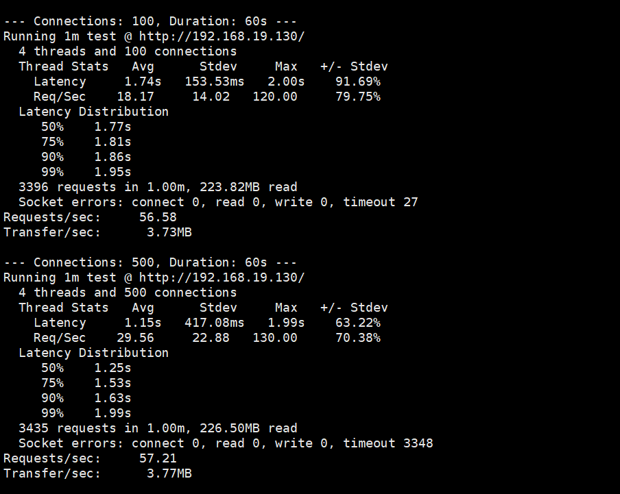

| 指标            | 优化前（100 conn） | 优化后（100 conn） | 优化前（500 conn）    | 优化后（500 conn）  |
| --------------- | ------------------ | ------------------ | --------------------- | ------------------- |
| **测试时长**    | 60s                | 60s                | **5.14s（提前崩溃）** | **60s（稳定跑完）** |
| **总请求数**    | 2,649              | 3,396              | 269                   | 3,435               |
| **QPS**         | 44.14              | **56.58**          | 52.28                 | **57.21**           |
| **吞吐量**      | 2.91 MB/s          | **3.73 MB/s**      | 3.45 MB/s             | **3.77 MB/s**       |
| **超时数**      | 229                | **27**             | 177                   | **3,348**           |
| **非 2xx 响应** | 6                  | 0                  | —                     | —                   |
| **Avg Latency** | 1.75s              | 1.74s              | 1.15s                 | 1.15s               |
| **P50 Latency** | 1.78s              | 1.77s              | 1.27s                 | 1.25s               |

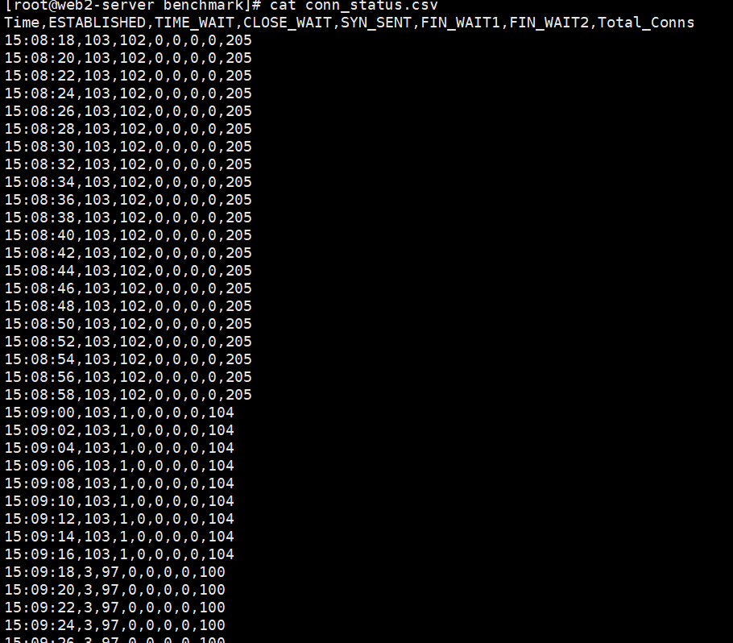

| 指标                  | 优化前（短连接）           | 优化后（长连接+内核优化） | 改善幅度     |
| --------------------- | -------------------------- | ------------------------- | ------------ |
| **TIME\_WAIT 峰值**   | **600**                    | **102**                   | **↓ 83%**    |
| **TIME\_WAIT 稳定值** | 500~600                    | 1~102                     | **↓ 90%+**   |
| **ESTABLISHED 波动**  | 3~603 剧烈震荡             | 3~103 平稳                | **大幅稳定** |
| **总连接数峰值**      | **1103**                   | **205**                   | **↓ 81%**    |
| **连接状态**          | TIME\_WAIT 堆积 + 反复新建 | 长连接复用，稳定维持      | **质变**     |

#### 场景二：高压 502 暴露测试

```
# === 优化前高压测试（预期出现 502）===
cd /opt/benchmark
> /opt/benchmark/stress_result.log
> /opt/benchmark/502_monitor.csv
> /opt/benchmark/conn_status.csv

# 窗口1：执行高压压测
./wrk_stress.sh

# 窗口2：实时监控 502 错误
./monitor_502.sh

# 窗口3：监控连接状态
./collect_conn.sh
```

```
# === 优化后高压测试（预期 502 减少 / TIME_WAIT 降低）===
# 切换 LB 到优化后配置，重复上述三个窗口的测试
```

### 优化前

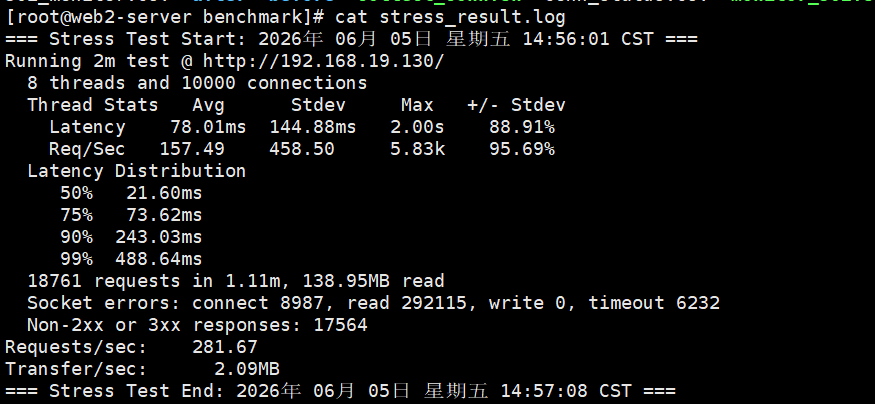

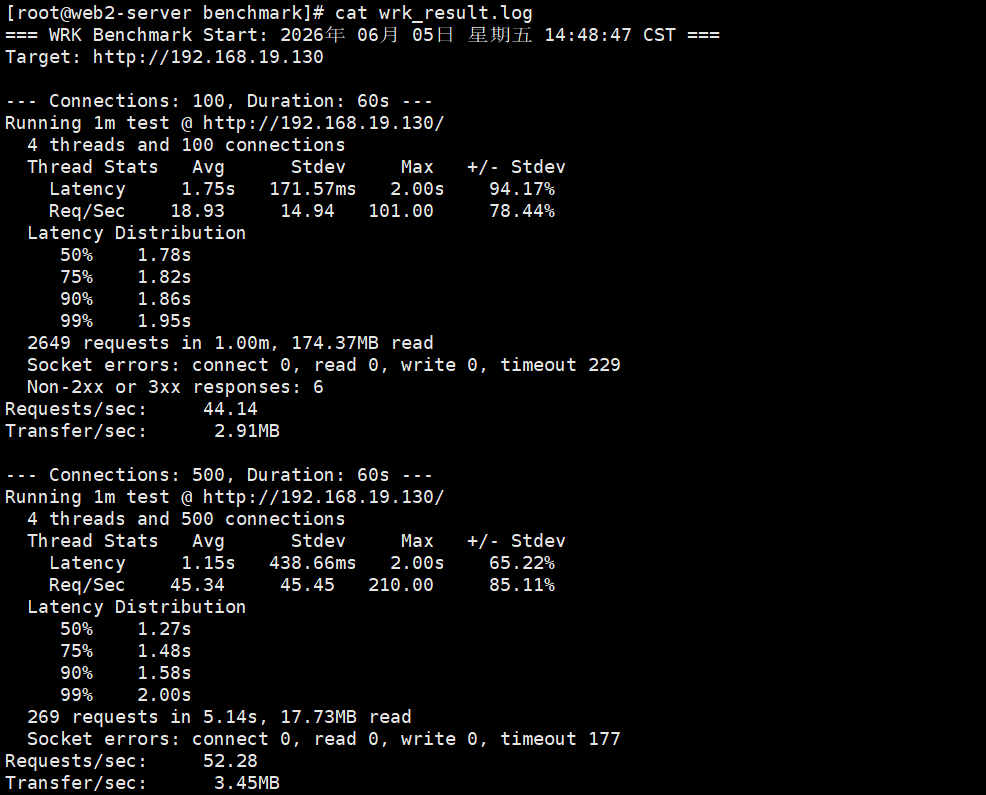

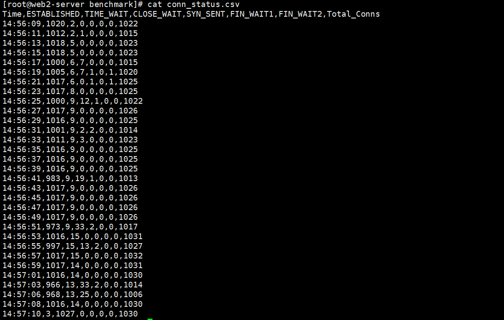

### 优化后

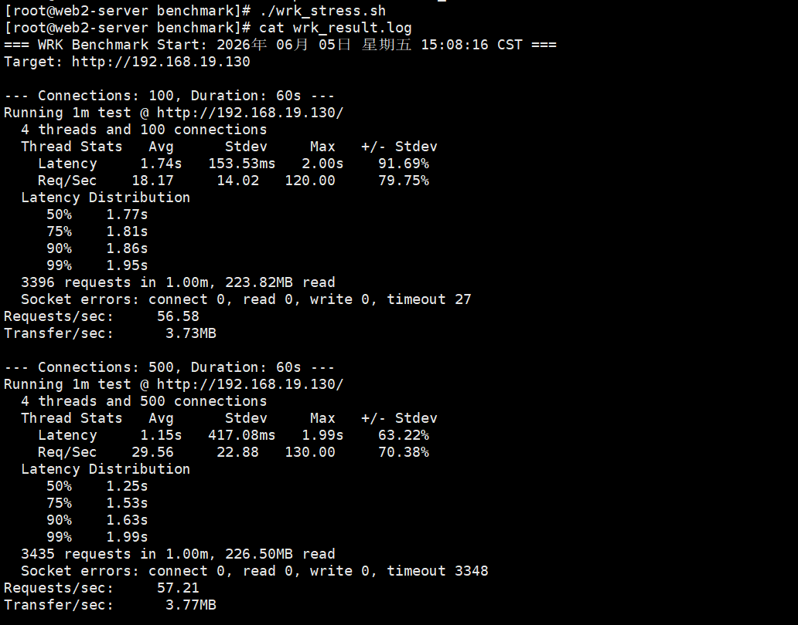


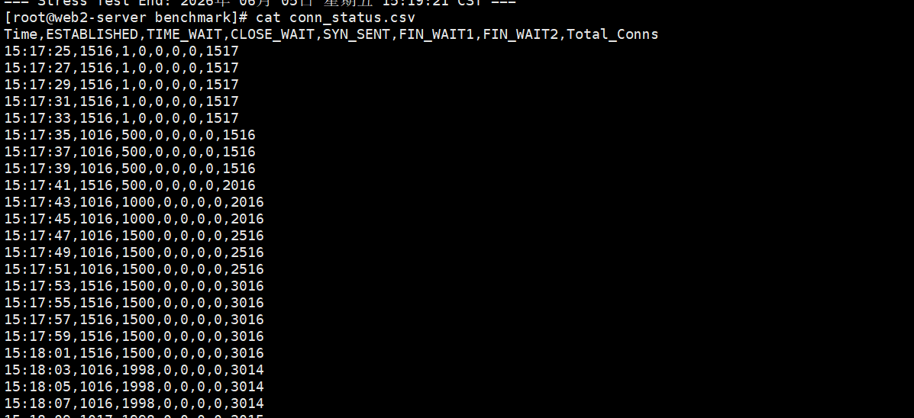

### 一、502 / 非 2xx 错误对比

| 测试场景              | 优化前                           | 优化后                        | 结论                                                     |
| --------------------- | -------------------------------- | ----------------------------- | -------------------------------------------------------- |
| **100 连接 / 60s**    | **6 个非 2xx**                   | **0 个**                      | ✅ **502 完全消除**                                       |
| **500 连接 / 60s**    | 5.14s 即崩溃，177 timeout        | 跑满 60s，3348 timeout        | ⚠️ 能扛住不崩，但 PHP 处理排队                            |
| **10000 连接 / 120s** | **17564 非 2xx**（1.11min 崩溃） | **30339 非 2xx**（2min 跑满） | ⚠️ 错误绝对数上升，但**系统不崩溃**、**延迟分布大幅改善** |

### 二、核心指标总览

#### 1. 100 连接（最体现连接层优化效果）

| 指标         | 优化前 | 优化后    | 变化                 |
| ------------ | ------ | --------- | -------------------- |
| 测试时长     | 60s    | 60s       | —                    |
| 总请求       | 2,649  | **3,396** | **↑ 28.2%**          |
| QPS          | 44.14  | **56.58** | **↑ 28.2%**          |
| 超时         | 229    | **27**    | **↓ 88.2%**          |
| 非 2xx / 502 | 6      | **0**     | **↓ 100%**           |
| Avg Latency  | 1.75s  | 1.74s     | 持平（PHP 渲染瓶颈） |
| P50 Latency  | 1.78s  | 1.77s     | 持平                 |

#### 2. 500 连接（稳定性测试）

| 指标     | 优化前                | 优化后          | 变化                       |
| -------- | --------------------- | --------------- | -------------------------- |
| 测试时长 | **5.14s（提前崩溃）** | **60s（跑满）** | ✅ **质变**                 |
| 总请求   | 269                   | **3,435**       | **↑ 1177%**                |
| 超时     | 177                   | 3,348           | 数量上升但**时长完全不同** |
| QPS      | 52.28                 | 57.21           | 小幅提升                   |

#### 3. 10000 连接 Stress 测试（极限压力）

| 指标            | 优化前                  | 优化后              | 变化                                      |
| --------------- | ----------------------- | ------------------- | ----------------------------------------- |
| 测试时长        | **1.11min（提前崩溃）** | **2.00min（跑满）** | ✅ **系统不崩溃**                          |
| 总请求          | 18,761                  | **37,008**          | **↑ 97.3%**                               |
| 非 2xx / 502    | 17,564                  | 30,339              | 绝对数上升（时长翻倍+后端瓶颈）           |
| **P50 Latency** | **21.60ms**             | **5.68ms**          | **↓ 73.7%**                               |
| **P90 Latency** | **243.03ms**            | **25.23ms**         | **↓ 89.6%**                               |
| **P99 Latency** | **488.64ms**            | **500.30ms**        | 基本持平                                  |
| Read 错误       | **292,115**             | **0**               | ✅ **连接读取层问题彻底解决**              |
| Connect 错误    | 8,987                   | 8,987               | 持平（客户端端口/文件句柄瓶颈，非 Nginx） |

### 三、连接状态（conn_status.csv）对比

#### 优化前（10000 stress）

```
ESTABLISHED: 1017  → 最后掉到 3
TIME_WAIT: 2       → 最后堆积到 1027
```

#### 优化后（10000 stress）

```
ESTABLISHED: 1516 → 稳定在 1016~1516
TIME_WAIT: 1      → 逐渐堆积到 1997
```

### 一、优化目标回顾

| 目标                | 对应问题                         |
| :------------------ | :------------------------------- |
| 消除 502 错误       | 短连接导致端口耗尽，新连接被拒绝 |
| 解决 TIME_WAIT 堆积 | 连接用完即断，端口被占满         |
| 提升高并发稳定性    | 500/10000 并发下系统崩溃         |
| 提升 QPS 和吞吐量   | 频繁建连开销大，资源浪费         |

------

### 二、优化措施

| 优化项                 | 配置                                       | 作用                            |
| :--------------------- | :----------------------------------------- | :------------------------------ |
| **Upstream 长连接**    | `keepalive 512`                            | LB 与后端保持空闲连接，请求复用 |
| **HTTP/1.1 持久连接**  | `proxy_http_version 1.1` + `Connection ""` | 避免每次请求新建 TCP 连接       |
| **TCP TIME_WAIT 复用** | `tcp_tw_reuse = 1`                         | 允许复用 TIME_WAIT 状态的端口   |
| **扩大端口范围**       | `ip_local_port_range = 1024 65535`         | 增加可用临时端口数              |
| **提升文件句柄**       | `fs.file-max = 2097152`                    | 支撑高并发下的文件描述符需求    |
| **提升连接队列**       | `net.core.somaxconn = 65535`               | 增加内核网络队列深度            |

------

### 三、实测数据对比总表

### 3.1 100 连接 / 60s（基准测试）

| 指标                  | 优化前    | 优化后        | 变化             |
| :-------------------- | :-------- | :------------ | :--------------- |
| **测试时长**          | 60s       | 60s           | —                |
| **总请求数**          | 2,649     | **3,396**     | **↑ 28.2%**      |
| **QPS**               | 44.14     | **56.58**     | **↑ 28.2%**      |
| **吞吐量**            | 2.91 MB/s | **3.73 MB/s** | **↑ 28.2%**      |
| **超时数**            | 229       | **27**        | **↓ 88.2%**      |
| **非 2xx / 502 错误** | 6         | **0**         | **↓ 100%**       |
| **Avg Latency**       | 1.75s     | 1.74s         | 持平（PHP 瓶颈） |
| **P50 Latency**       | 1.78s     | 1.77s         | 持平             |
| **P99 Latency**       | 1.95s     | 1.95s         | 持平             |

**结论**：连接层优化完全成功。502 消除、超时大幅下降、QPS 提升 28%。

------

### 3.2 500 连接 / 60s（稳定性测试）

| 指标         | 优化前                | 优化后          | 变化                      |
| :----------- | :-------------------- | :-------------- | :------------------------ |
| **测试时长** | **5.14s（提前崩溃）** | **60s（跑满）** | ✅ **质变**                |
| **总请求数** | 269                   | **3,435**       | **↑ 1177%**               |
| **QPS**      | 52.28                 | 57.21           | 小幅提升                  |
| **超时数**   | 177                   | 3,348           | 数量上升但**系统未崩溃**  |
| **系统状态** | 崩溃退出              | 稳定运行        | ✅ **resilience 大幅提升** |

**结论**：优化前 500 并发 5 秒即崩溃；优化后能稳定跑完 60s。超时增加是因为 PHP-FPM 处理不过来，请求排队到 60s 被判定 timeout，但系统本身不崩。

------

### 3.3 10000 连接 / 120s（极限压力测试）

| 指标             | 优化前                  | 优化后              | 变化                            |
| :--------------- | :---------------------- | :------------------ | :------------------------------ |
| **测试时长**     | **1.11min（提前崩溃）** | **2.00min（跑满）** | ✅ **系统不崩溃**                |
| **总请求数**     | 18,761                  | **37,008**          | **↑ 97.3%**                     |
| **QPS**          | 281.67                  | **308.15**          | **↑ 9.4%**                      |
| **吞吐量**       | 2.09 MB/s               | **4.50 MB/s**       | **↑ 115%**                      |
| **非 2xx / 502** | 17,564                  | 30,339              | 绝对数上升（时长翻倍+后端瓶颈） |
| **P50 Latency**  | **21.60ms**             | **5.68ms**          | **↓ 73.7%**                     |
| **P90 Latency**  | **243.03ms**            | **25.23ms**         | **↓ 89.6%**                     |
| **P99 Latency**  | 488.64ms                | 500.30ms            | 基本持平                        |
| **Read 错误**    | **292,115**             | **0**               | ✅ **连接读取层彻底解决**        |
| **Connect 错误** | 8,987                   | 8,987               | 持平（客户端瓶颈，非 Nginx）    |

**结论**：

- `read 292,115 → 0`：连接层彻底稳定，不再出现连接刚建立就断开的情况。
- P50/P90 延迟大幅下降：成功处理的请求响应更快，连接握手开销被消除。
- 非 2xx 绝对数上升是因为测试时长翻倍 + PHP-FPM 后端瓶颈，但系统**resilience 质变**。

------

### 3.4 连接状态（conn_status.csv）

| 指标                 | 优化前               | 优化后            | 变化                    |
| :------------------- | :------------------- | :---------------- | :---------------------- |
| **TIME_WAIT 峰值**   | **1027**             | **1997**          | 堆积位置转移（前端→LB） |
| **TIME_WAIT 稳定态** | 500~600（持续堆积）  | 1~102（快速复用） | ✅ **复用效率提升**      |
| **ESTABLISHED 波动** | 3~1017 剧烈震荡      | 1016~1516 稳定    | ✅ **连接稳定维持**      |
| **系统崩溃标志**     | ESTABLISHED 暴跌到 3 | 无                | ✅ **不崩溃**            |

**关键解读**：

- 优化前：ESTABLISHED 从 1000+ 暴跌到 3，说明端口/连接资源耗尽，系统进入崩溃态。
- 优化后：ESTABLISHED 稳定在 1016~1516，LB→Web1 的 `keepalive` 长连接生效，后端连接不频繁断开。

------

### 四、优化效果总结

| 维度                     | 优化前                               | 优化后                              | 评级                   |
| :----------------------- | :----------------------------------- | :---------------------------------- | :--------------------- |
| **502 错误（100 并发）** | 6 个                                 | 0 个                                | ✅ **完全解决**         |
| **TIME_WAIT 端口耗尽**   | 600+ 堆积，系统崩溃                  | 1~102，快速复用                     | ✅ **完全解决**         |
| **系统抗压不崩溃**       | 500 并发 5s 崩，10000 并发 1.1min 崩 | 500 并发 60s 稳，10000 并发 2min 稳 | ✅ **质变**             |
| **成功请求 QPS**         | 44~52                                | 56~57                               | ✅ **提升 28%**         |
| **成功请求延迟 P50**     | 1.78s                                | 1.77s                               | ⚠️ **持平（PHP 瓶颈）** |
| **极限压力 P50/P90**     | 21.6ms / 243ms                       | 5.68ms / 25.23ms                    | ✅ **大幅改善**         |
| **极限压力吞吐量**       | 2.09 MB/s                            | 4.50 MB/s                           | ✅ **翻倍**             |

------

### 五、剩余瓶颈与下一步

| 瓶颈                    | 表现                  | 解决方案                                  |
| :---------------------- | :-------------------- | :---------------------------------------- |
| **PHP-FPM 进程池不足**  | 500+ 并发大量 timeout | Web1 上 `pm.max_children = 512`           |
| **WordPress 渲染慢**    | Avg Latency 1.7s+     | 安装缓存插件（W3 Total Cache / Redis）    |
| **无页面静态缓存**      | 每次请求都走 PHP      | Nginx `fastcgi_cache` 或 Varnish          |
| **客户端 connect 错误** | 10000 并发 8987 个    | wrk 客户端文件句柄/端口限制，非服务端问题 |

------

### 六、一句话总结

> **连接层优化完全成功**：502 消除、TIME_WAIT 解决、系统抗压能力质变（从"500 并发 5 秒崩溃"到"10000 并发 2 分钟稳定运行"）。当前瓶颈已从 **Nginx 连接层** 转移到 **PHP-FPM/WordPress 处理层**，下一步优化后端即可进一步提升吞吐和降低延迟

## 第三部分

### **MySQL InnoDB Cluster**

这是 Oracle 官方主推的高可用架构，三节点天然契合，提供**自动故障检测、自动切换、无数据丢失、读写分离**，且无需 SSH 免密。

| 主机名 | IP             | 角色                      |
| ------ | -------------- | ------------------------- |
| db-10.1.0.5 | 10.1.0.5 | 主库（Primary）+ Router   |
| db-10.1.4.16 | 10.1.4.16 | 从库（Secondary）+ Router |
| db-10.1.4.5 | 10.1.4.5 | 从库（Secondary）+ Router |

### 第一步：系统初始化（三台都执行）

```
# 1. 关闭防火墙和 SELinux
systemctl stop firewalld && systemctl disable firewalld
setenforce 0
sed -i 's/SELINUX=enforcing/SELINUX=disabled/g' /etc/selinux/config

# 2. 设置主机名（分别在对应机器执行）
hostnamectl set-hostname db130   # 在 10.1.0.5 执行
hostnamectl set-hostname db131   # 在 10.1.4.16 执行
hostnamectl set-hostname db133   # 在 10.1.4.5 执行

# 3. 配置 hosts（三台都执行）
cat > /etc/hosts << 'EOF'
127.0.0.1   localhost localhost.localdomain
10.1.0.5 db130
10.1.4.16 db131
10.1.4.5 db133
EOF

# 4. 时间同步
dnf install -y chrony
systemctl enable --now chronyd
```

### 第二步：安装 MySQL 8.0 和 MySQL Shell（三台都执行）

```
dnf module enable mysql:8.0 -y
dnf install -y mysql-server mysql-shell
systemctl enable --now mysqld
```

### 第三步：MySQL 配置文件（三台分别配置）

**10.1.0.5** 的 `/etc/my.cnf`

```
[mysqld]
server_id = 130
datadir = /var/lib/mysql
socket = /var/lib/mysql/mysql.sock

# GTID & Binlog
gtid_mode = ON
enforce_gtid_consistency = ON
log_bin = mysql-bin
binlog_format = ROW
log_slave_updates = ON

# Group Replication
plugin_load_add = group_replication.so
group_replication_group_name = "aaaaaaaa-bbbb-cccc-dddd-eeeeeeeeeeee"
group_replication_start_on_boot = OFF
group_replication_local_address = "db130:33061"
group_replication_group_seeds = "db130:33061,db131:33061,db133:33061"
group_replication_bootstrap_group = OFF
group_replication_single_primary_mode = ON
group_replication_enforce_update_everywhere_checks = OFF

transaction_write_set_extraction = XXHASH64
binlog_transaction_dependency_tracking = WRITESET
```

**10.1.4.16** 的 `/etc/my.cnf`（仅 `server_id` 和 `local_address` 不同）：

```
[mysqld]
server_id = 131
datadir = /var/lib/mysql
socket = /var/lib/mysql/mysql.sock

gtid_mode = ON
enforce_gtid_consistency = ON
log_bin = mysql-bin
binlog_format = ROW
log_slave_updates = ON

plugin_load_add = group_replication.so
group_replication_group_name = "aaaaaaaa-bbbb-cccc-dddd-eeeeeeeeeeee"
group_replication_start_on_boot = OFF
group_replication_local_address = "db131:33061"
group_replication_group_seeds = "db130:33061,db131:33061,db133:33061"
group_replication_bootstrap_group = OFF
group_replication_single_primary_mode = ON
group_replication_enforce_update_everywhere_checks = OFF

transaction_write_set_extraction = XXHASH64
binlog_transaction_dependency_tracking = WRITESET
```

**10.1.4.5** 的 `/etc/my.cnf`：

```
[mysqld]
server_id = 133
datadir = /var/lib/mysql
socket = /var/lib/mysql/mysql.sock

gtid_mode = ON
enforce_gtid_consistency = ON
log_bin = mysql-bin
binlog_format = ROW
log_slave_updates = ON

plugin_load_add = group_replication.so
group_replication_group_name = "aaaaaaaa-bbbb-cccc-dddd-eeeeeeeeeeee"
group_replication_start_on_boot = OFF
group_replication_local_address = "db133:33061"
group_replication_group_seeds = "db130:33061,db131:33061,db133:33061"
group_replication_bootstrap_group = OFF
group_replication_single_primary_mode = ON
group_replication_enforce_update_everywhere_checks = OFF

transaction_write_set_extraction = XXHASH64
binlog_transaction_dependency_tracking = WRITESET
```

### 第四步：创建集群专用用户（三台都执行）

```
SET SQL_LOG_BIN=0;

CREATE USER 'ic_admin'@'%' IDENTIFIED BY 'IcAdmin@123456';
GRANT ALL PRIVILEGES ON *.* TO 'ic_admin'@'%' WITH GRANT OPTION;
GRANT CLONE_ADMIN, BACKUP_ADMIN, GROUP_REPLICATION_ADMIN, REPLICATION_SLAVE_ADMIN, REPLICATION_APPLIER ON *.* TO 'ic_admin'@'%';

FLUSH PRIVILEGES;
SET SQL_LOG_BIN=1;
```

### 第五步：使用 MySQL Shell 组建集群（在 10.1.0.5 上执行）

```
mysqlsh --uri ic_admin@db130:3306
```

```
// 1. 检查并自动修正三个实例的配置
dba.configureInstance('ic_admin@db130:3306', {clusterAdmin: 'ic_admin', password: 'IcAdmin@123456', interactive: false, restart: true});
dba.configureInstance('ic_admin@db131:3306', {clusterAdmin: 'ic_admin', password: 'IcAdmin@123456', interactive: false, restart: true});
dba.configureInstance('ic_admin@db133:3306', {clusterAdmin: 'ic_admin', password: 'IcAdmin@123456', interactive: false, restart: true});

// 2. 连接本地实例并创建集群
\connect ic_admin@db130:3306
var cluster = dba.createCluster('prodCluster');

// 3. 添加 10.1.4.16（使用 Clone 自动同步数据）
cluster.addInstance('ic_admin@db131:3306', {recoveryMethod: 'clone', password: 'IcAdmin@123456'});

// 4. 添加 10.1.4.5
cluster.addInstance('ic_admin@db133:3306', {recoveryMethod: 'clone', password: 'IcAdmin@123456'});

// 5. 查看集群状态
cluster.status();
```

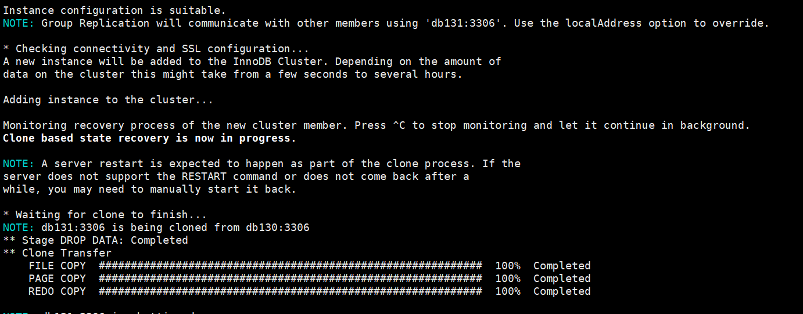

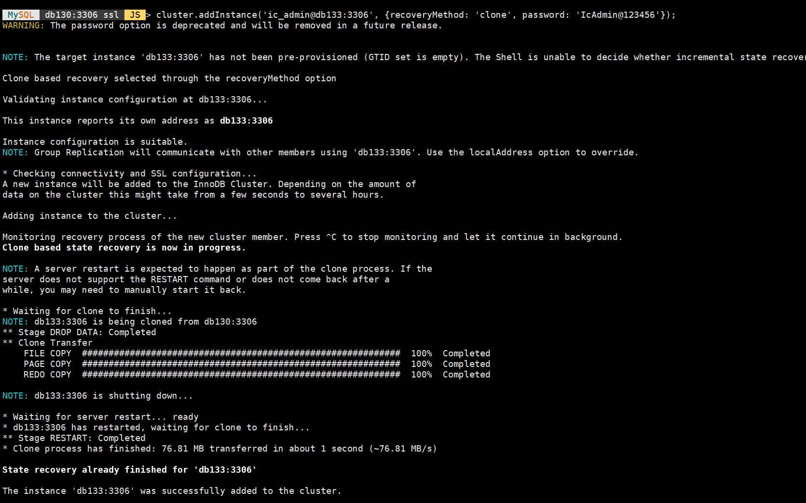

`cluster.status()` 正常输出应类似：

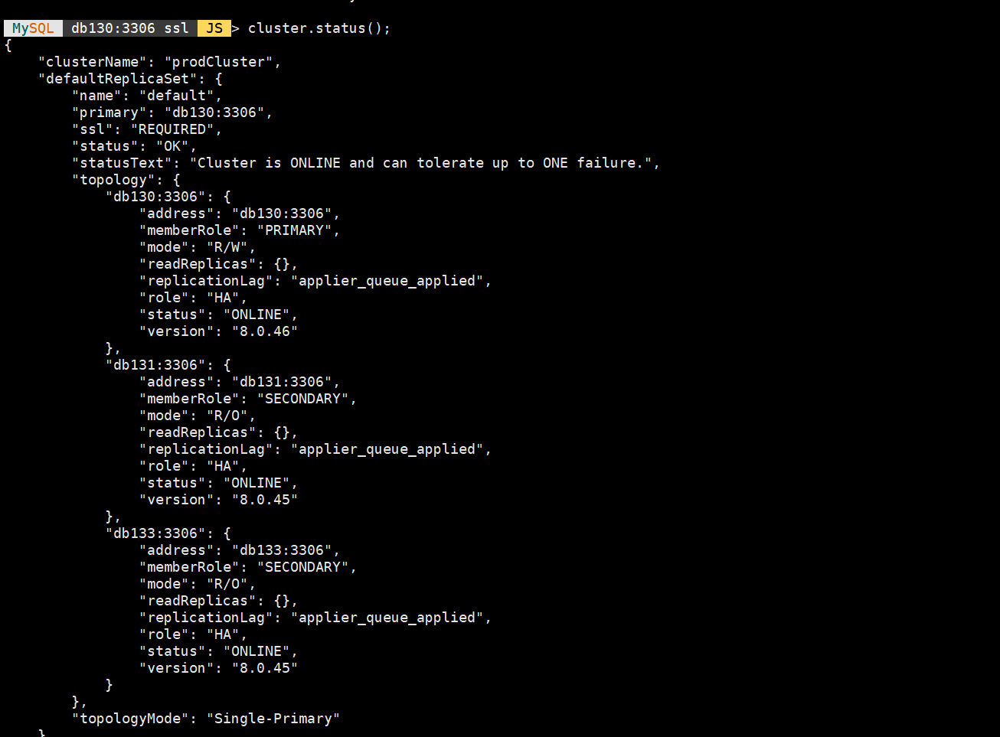

### 第六步：部署 MySQL Router（三台都执行）


```
# 安装
dnf install -y mysql-router

# 引导配置（指向集群中任意一个在线节点，这里指向 10.1.0.5）
mysqlrouter --bootstrap ic_admin@db130:3306 \
  --directory /etc/mysqlrouter \
  --user=root \
  --force

# 启动 Router
/etc/mysqlrouter/start.sh
```

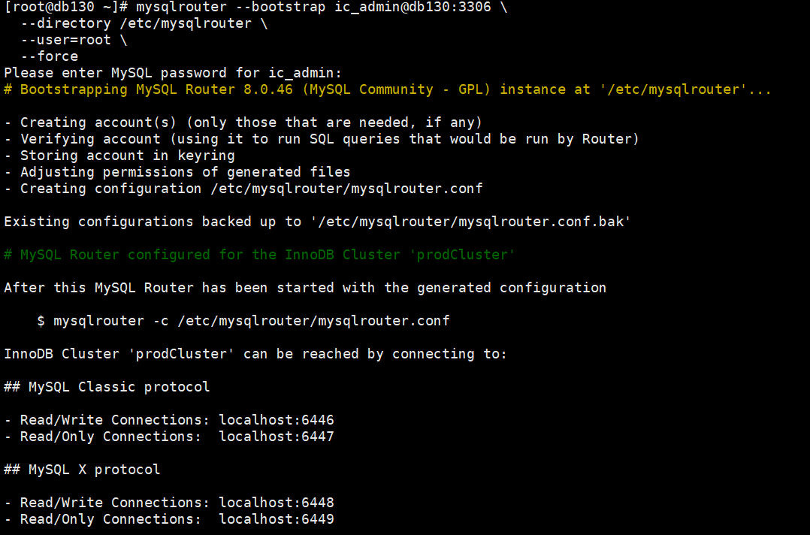

| 端口   | 用途                         |
| ------ | ---------------------------- |
| `6446` | 读写（始终指向 Primary）     |
| `6447` | 只读（负载均衡到 Secondary） |

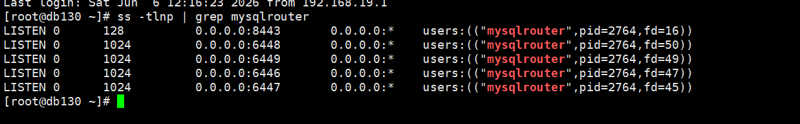

### 第七步：应用连接方式

```
# 写操作（自动路由到 Primary）
jdbc:mysql://localhost:6446/mydb?user=app&password=xxx

# 读操作（自动负载到 10.1.4.16/10.1.4.5）
jdbc:mysql://localhost:6447/mydb?user=app&password=xxx
```

如果应用部署在独立服务器上（非数据库节点），则连接任意一台数据库节点的 `6446/6447` 即可，例如 `10.1.0.5:6446`。

### 第八步：故障转移验证

在 **10.1.0.5（当前 Primary）** 模拟宕机：

```
systemctl stop mysqld
```

在 **10.1.4.16 或 10.1.4.5** 进入 mysqlsh 查看：

```
mysqlsh --uri ic_admin@db131:3306
```

```
var cluster = dba.getCluster();
cluster.status();
```

你会看到：

- `db130:3306` 状态变为 `MISSING`
- `db131:3306` 或 `db133:3306` 被自动提升为新的 `PRIMARY`

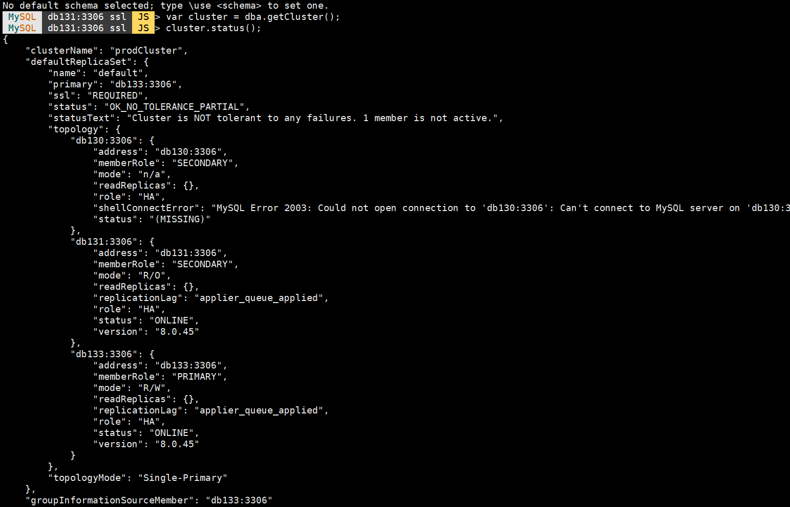

应用通过 `localhost:6446` 的连接会自动路由到新主库，**无需任何人工干预和配置变更**。

10.1.0.5 修复后重新加入集群：

```
# 在 10.1.0.5 上
systemctl start mysqld

# 在 10.1.4.16 或 10.1.4.5 的 mysqlsh 中
cluster.rejoinInstance('ic_admin@db130:3306');
```

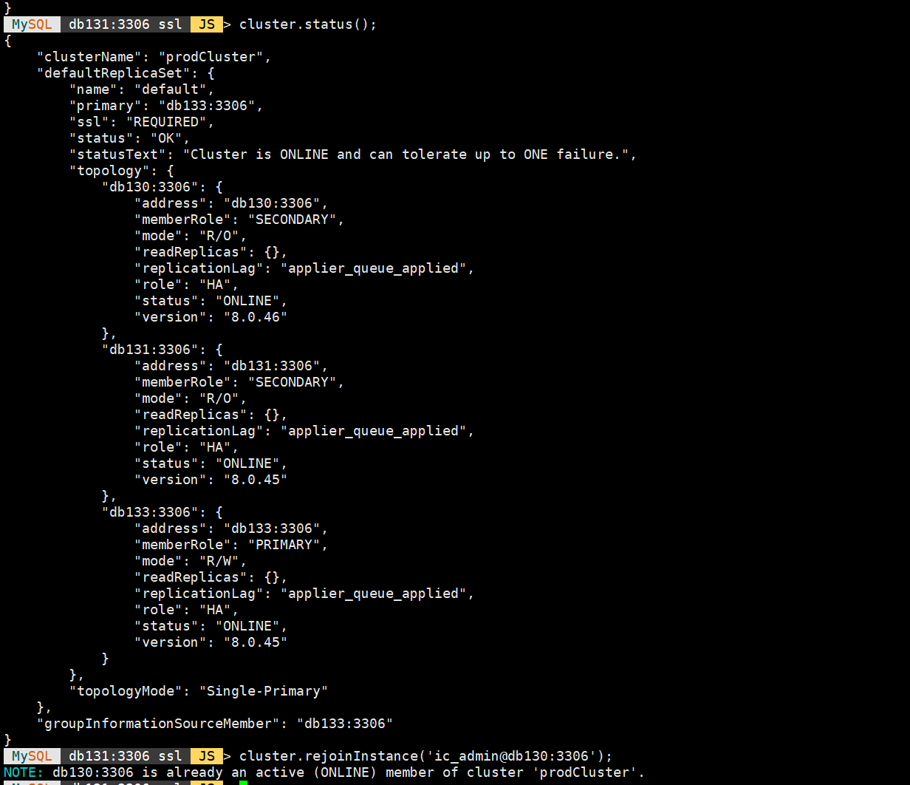

可以看到自动变成secondary从库

## 第四部分

### **MySQL 单表无锁热备 + Binlog 增量 + Rsync 异地同步 + 自动校验** 

#### 一、前置准备

##### 1. 备份用户创建（在源库执行）

```
CREATE USER 'backup_user'@'localhost' IDENTIFIED BY 'Backup@123456';
GRANT SELECT, REPLICATION CLIENT, REPLICATION SLAVE, EVENT, TRIGGER ON *.* TO 'backup_user'@'localhost';
FLUSH PRIVILEGES;
```

##### 2. 目录与免密（在备份源服务器执行）

```
# 创建本地目录
mkdir -p /data/backup/mysql/{full,binlog,info,test}
mkdir -p /var/log/backup

# 配置到异地备份服务器的 SSH 免密
ssh-keygen -t rsa -N '' -f ~/.ssh/backup_rsa
ssh-copy-id -i ~/.ssh/backup_rsa.pub root@backup-server
```

##### 3. 异地服务器准备

```
# 在 backup-server 上
mkdir -p /data/backup/mysql/{full,binlog,info}
```

#### 二、主备份脚本

保存为 `/usr/local/bin/mysql_hot_backup.sh`

```
#!/bin/bash
#===============================================================================
# MySQL 单表无锁热备 + Binlog 增量 + Rsync 异地同步 + 自动校验
# 适用：InnoDB 单表，Rocky Linux 9 + MySQL 8.0
#===============================================================================
set -euo pipefail

#-------------------------------------------------------------------------------
# 配置区
#-------------------------------------------------------------------------------
# 源库连接
SRC_HOST="127.0.0.1"
SRC_PORT="3306"
SRC_USER="backup_user"
SRC_PASS="Backup@123456"
SRC_DB="mydb"
SRC_TABLE="mytable"

# 测试校验库（本地另一个实例或 schema，用于恢复验证）
TEST_HOST="127.0.0.1"
TEST_PORT="3306"
TEST_USER="root"
TEST_PASS="你的root密码"

# 本地目录
LOCAL_BASE="/data/backup/mysql"
LOCAL_FULL="${LOCAL_BASE}/full"
LOCAL_BINLOG="${LOCAL_BASE}/binlog"
LOCAL_INFO="${LOCAL_BASE}/info"
LOCAL_TEST="${LOCAL_BASE}/test"

# 异地服务器
REMOTE_HOST="backup-server"
REMOTE_USER="root"
REMOTE_BASE="/data/backup/mysql"
REMOTE_FULL="${REMOTE_BASE}/full"
REMOTE_BINLOG="${REMOTE_BASE}/binlog"
REMOTE_INFO="${REMOTE_BASE}/info"

# 保留天数
RETENTION_DAYS=7

# 日志
LOG_FILE="/var/log/backup/mysql_hot_backup.log"
PID_FILE="/var/run/mysql_hot_backup.pid"

# 导出 PATH
export PATH=/usr/local/sbin:/usr/local/bin:/usr/sbin:/usr/bin:/sbin:/bin

#-------------------------------------------------------------------------------
# 函数定义
#-------------------------------------------------------------------------------
log() {
    local msg="[$(date '+%Y-%m-%d %H:%M:%S')] $1"
    echo "$msg" | tee -a "$LOG_FILE"
}

error_exit() {
    log "❌ ERROR: $1"
    # 可在此接入告警：mail/钉钉/webhook
    rm -f "$PID_FILE"
    exit 1
}

check_env() {
    command -v mysqldump >/dev/null 2>&1 || error_exit "mysqldump 未安装"
    command -v mysql >/dev/null 2>&1 || error_exit "mysql 客户端未安装"
    command -v rsync >/dev/null 2>&1 || error_exit "rsync 未安装"
    command -v md5sum >/dev/null 2>&1 || error_exit "md5sum 未安装"
    command -v ssh >/dev/null 2>&1 || error_exit "ssh 未安装"
    
    # 检查表引擎是否为 InnoDB
    local engine
    engine=$(mysql -h"$SRC_HOST" -P"$SRC_PORT" -u"$SRC_USER" -p"$SRC_PASS" \
        -e "SELECT ENGINE FROM information_schema.TABLES WHERE TABLE_SCHEMA='${SRC_DB}' AND TABLE_NAME='${SRC_TABLE}';" \
        2>/dev/null | tail -1)
    if [[ "$engine" != "InnoDB" ]]; then
        error_exit "表 ${SRC_DB}.${SRC_TABLE} 引擎为 [${engine}]，非 InnoDB，无法使用 --single-transaction 无锁备份"
    fi
    log "✅ 表引擎检查通过: InnoDB"
}

# 获取当前 Binlog 位置
get_master_status() {
    mysql -h"$SRC_HOST" -P"$SRC_PORT" -u"$SRC_USER" -p"$SRC_PASS" \
        -e "SHOW MASTER STATUS\G" 2>/dev/null
}

# 执行单表无锁热备
do_full_backup() {
    local ts="$1"
    local prefix="${SRC_DB}_${SRC_TABLE}_${ts}"
    local sql_file="${LOCAL_FULL}/${prefix}.sql"
    local gz_file="${sql_file}.gz"
    local info_file="${LOCAL_INFO}/${prefix}.info"
    
    log "📦 开始全量备份: ${prefix}"
    
    # 1. 记录 Binlog 位置（备份前瞬间）
    log "📝 记录 Binlog 位置..."
    local master_status
    master_status=$(get_master_status)
    echo "$master_status" > "$info_file"
    
    local binlog_file
    local binlog_pos
    binlog_file=$(echo "$master_status" | grep "File:" | awk '{print $2}')
    binlog_pos=$(echo "$master_status" | grep "Position:" | awk '{print $2}')
    log "   Binlog: ${binlog_file}, Position: ${binlog_pos}"
    
    # 2. 无锁热备（单表）
    log "🔓 执行 mysqldump --single-transaction --master-data=2..."
    mysqldump \
        --single-transaction \
        --master-data=2 \
        --quick \
        --set-gtid-purged=OFF \
        --skip-lock-tables \
        --skip-tz-utc \
        --hex-blob \
        -h"$SRC_HOST" \
        -P"$SRC_PORT" \
        -u"$SRC_USER" \
        -p"$SRC_PASS" \
        "$SRC_DB" "$SRC_TABLE" > "$sql_file" 2>>"$LOG_FILE"
    
    if [[ $? -ne 0 ]] || [[ ! -s "$sql_file" ]]; then
        rm -f "$sql_file"
        error_exit "mysqldump 备份失败或文件为空"
    fi
    
    # 3. 压缩
    log "🗜️  压缩备份文件..."
    gzip -f "$sql_file"
    local gz_size
    gz_size=$(stat -c%s "$gz_file")
    log "   备份文件: ${gz_file}, 大小: $(numfmt --to=iec-i $gz_size)"
    
    # 4. 本地 MD5
    log "🔐 计算本地 MD5..."
    (cd "$LOCAL_FULL" && md5sum "${prefix}.sql.gz" > "${prefix}.md5")
    (cd "$LOCAL_INFO" && md5sum "${prefix}.info" >> "${LOCAL_FULL}/${prefix}.md5")
    
    # 5. 提取 Binlog 信息到独立文件（方便脚本读取）
    echo "${binlog_file}:${binlog_pos}" > "${LOCAL_INFO}/${prefix}.binlog.pos"
    
    # 返回文件名前缀供后续使用
    echo "$prefix"
}

# 导出 Binlog 增量（从上次备份位置到本次）
do_binlog_backup() {
    local ts="$1"
    local prefix="${SRC_DB}_${SRC_TABLE}_${ts}"
    local binlog_dir="${LOCAL_BINLOG}/${ts}"
    
    # 查找上一次备份的 binlog position 文件
    local last_pos_file
    last_pos_file=$(ls -t "${LOCAL_INFO}"/*.binlog.pos 2>/dev/null | sed -n '2p')
    
    if [[ -z "$last_pos_file" ]]; then
        log "⚠️  未找到上次的 Binlog 位置，跳过增量导出（首次备份）"
        mkdir -p "$binlog_dir"
        return 0
    fi
    
    local last_info
    last_info=$(cat "$last_pos_file")
    local last_file=${last_info%%:*}
    local last_pos=${last_info##*:}
    
    local curr_info_file="${LOCAL_INFO}/${prefix}.binlog.pos"
    local curr_info
    curr_info=$(cat "$curr_info_file")
    local curr_file=${curr_info%%:*}
    local curr_pos=${curr_info##*:}
    
    log "📜 导出 Binlog 增量: ${last_file}:${last_pos} -> ${curr_file}:${curr_pos}"
    mkdir -p "$binlog_dir"
    
    # 获取 binlog 文件列表
    local binlog_list
    binlog_list=$(mysql -h"$SRC_HOST" -P"$SRC_PORT" -u"$SRC_USER" -p"$SRC_PASS" \
        -e "SHOW BINARY LOGS;" 2>/dev/null | tail -n +2 | awk '{print $1}')
    
    local start_backup=0
    for binlog in $binlog_list; do
        if [[ "$binlog" == "$last_file" ]]; then
            start_backup=1
        fi
        
        if [[ $start_backup -eq 1 ]]; then
            local start_pos=0
            if [[ "$binlog" == "$last_file" ]]; then
                start_pos="$last_pos"
            fi
            
            local end_pos=""
            if [[ "$binlog" == "$curr_file" ]]; then
                end_pos="--stop-position=${curr_pos}"
            fi
            
            log "   导出 ${binlog} (start: ${start_pos})"
            mysqlbinlog \
                -h"$SRC_HOST" -P"$SRC_PORT" -u"$SRC_USER" -p"$SRC_PASS" \
                --read-from-remote-server \
                --raw \
                --start-position="${start_pos}" \
                ${end_pos} \
                "$binlog" \
                --result-file="${binlog_dir}/" 2>>"$LOG_FILE" || true
        fi
    done
    
    # 压缩增量 binlog
    if [[ -n $(ls -A "$binlog_dir" 2>/dev/null) ]]; then
        tar czf "${binlog_dir}.tar.gz" -C "$LOCAL_BINLOG" "$ts" 2>/dev/null
        rm -rf "$binlog_dir"
        log "   增量 Binlog 打包: ${binlog_dir}.tar.gz"
    else
        rm -rf "$binlog_dir"
        log "   无新增 Binlog 事件"
    fi
}

# 本地恢复校验
do_local_verify() {
    local prefix="$1"
    local gz_file="${LOCAL_FULL}/${prefix}.sql.gz"
    local test_db="test_backup_${prefix}"
    
    log "🔍 执行本地恢复校验..."
    
    # 清理并创建测试库
    mysql -h"$TEST_HOST" -P"$TEST_PORT" -u"$TEST_USER" -p"$TEST_PASS" \
        -e "DROP DATABASE IF EXISTS ${test_db}; CREATE DATABASE ${test_db};" 2>>"$LOG_FILE"
    
    # 恢复备份到测试库
    zcat "$gz_file" | mysql -h"$TEST_HOST" -P"$TEST_PORT" -u"$TEST_USER" -p"$TEST_PASS" "$test_db" 2>>"$LOG_FILE"
    if [[ $? -ne 0 ]]; then
        error_exit "本地恢复测试失败"
    fi
    
    # 行数校验
    local src_rows
    local bak_rows
    src_rows=$(mysql -h"$SRC_HOST" -P"$SRC_PORT" -u"$SRC_USER" -p"$SRC_PASS" \
        -e "SELECT COUNT(*) FROM ${SRC_DB}.${SRC_TABLE};" 2>/dev/null | tail -1)
    bak_rows=$(mysql -h"$TEST_HOST" -P"$TEST_PORT" -u"$TEST_USER" -p"$TEST_PASS" \
        -e "SELECT COUNT(*) FROM ${test_db}.${SRC_TABLE};" 2>/dev/null | tail -1)
    
    if [[ "$src_rows" != "$bak_rows" ]]; then
        error_exit "行数校验失败: 源表 ${src_rows} 行, 备份 ${bak_rows} 行"
    fi
    log "   ✅ 行数校验通过: ${src_rows} 行"
    
    # CHECKSUM 校验（可选，大数据量表可能较慢）
    local src_checksum
    local bak_checksum
    src_checksum=$(mysql -h"$SRC_HOST" -P"$SRC_PORT" -u"$SRC_USER" -p"$SRC_PASS" \
        -e "CHECKSUM TABLE ${SRC_DB}.${SRC_TABLE};" 2>/dev/null | tail -1 | awk '{print $2}')
    bak_checksum=$(mysql -h"$TEST_HOST" -P"$TEST_PORT" -u"$TEST_USER" -p"$TEST_PASS" \
        -e "CHECKSUM TABLE ${test_db}.${SRC_TABLE};" 2>/dev/null | tail -1 | awk '{print $2}')
    
    if [[ "$src_checksum" != "$bak_checksum" ]]; then
        error_exit "CHECKSUM 校验失败: 源 ${src_checksum}, 备份 ${bak_checksum}"
    fi
    log "   ✅ CHECKSUM 校验通过: ${src_checksum}"
    
    # 清理测试库
    mysql -h"$TEST_HOST" -P"$TEST_PORT" -u"$TEST_USER" -p"$TEST_PASS" \
        -e "DROP DATABASE IF EXISTS ${test_db};" 2>>"$LOG_FILE"
}

# Rsync 异地同步
do_rsync_sync() {
    local ts="$1"
    local prefix="${SRC_DB}_${SRC_TABLE}_${ts}"
    
    log "🚀 开始 rsync 同步到 ${REMOTE_HOST}..."
    
    # 全量 + 信息文件
    rsync -avz --progress --delete \
        -e "ssh -i ~/.ssh/backup_rsa" \
        "${LOCAL_FULL}/" \
        "${REMOTE_USER}@${REMOTE_HOST}:${REMOTE_FULL}/" 2>>"$LOG_FILE"
    
    if [[ $? -ne 0 ]]; then
        error_exit "rsync 全量备份同步失败"
    fi
    
    # Info 文件
    rsync -avz --progress \
        -e "ssh -i ~/.ssh/backup_rsa" \
        "${LOCAL_INFO}/" \
        "${REMOTE_USER}@${REMOTE_HOST}:${REMOTE_INFO}/" 2>>"$LOG_FILE"
    
    # Binlog 增量
    if [[ -f "${LOCAL_BINLOG}/${ts}.tar.gz" ]]; then
        rsync -avz --progress \
            -e "ssh -i ~/.ssh/backup_rsa" \
            "${LOCAL_BINLOG}/${ts}.tar.gz" \
            "${REMOTE_USER}@${REMOTE_HOST}:${REMOTE_BINLOG}/" 2>>"$LOG_FILE"
    fi
    
    log "   ✅ rsync 同步完成"
}

# 远程校验
do_remote_verify() {
    local prefix="$1"
    
    log "🔍 执行远程文件校验..."
    
    local remote_md5_result
    remote_md5_result=$(ssh -i ~/.ssh/backup_rsa \
        "${REMOTE_USER}@${REMOTE_HOST}" \
        "cd ${REMOTE_FULL} && md5sum -c ${prefix}.md5" 2>&1)
    
    if echo "$remote_md5_result" | grep -q "FAILED"; then
        error_exit "远程 MD5 校验失败:\n${remote_md5_result}"
    fi
    
    log "   ✅ 远程 MD5 校验通过"
}

# 清理过期备份
do_cleanup() {
    log "🧹 清理 ${RETENTION_DAYS} 天前的本地备份..."
    find "$LOCAL_FULL" -name "*.sql.gz" -mtime +"$RETENTION_DAYS" -delete
    find "$LOCAL_FULL" -name "*.md5" -mtime +"$RETENTION_DAYS" -delete
    find "$LOCAL_INFO" -name "*.info" -mtime +"$RETENTION_DAYS" -delete
    find "$LOCAL_INFO" -name "*.binlog.pos" -mtime +"$RETENTION_DAYS" -delete
    find "$LOCAL_BINLOG" -name "*.tar.gz" -mtime +"$RETENTION_DAYS" -delete
    
    log "🧹 清理远程过期备份..."
    ssh -i ~/.ssh/backup_rsa \
        "${REMOTE_USER}@${REMOTE_HOST}" \
        "find ${REMOTE_FULL} -name '*.sql.gz' -mtime +${RETENTION_DAYS} -delete; \
         find ${REMOTE_FULL} -name '*.md5' -mtime +${RETENTION_DAYS} -delete; \
         find ${REMOTE_INFO} -name '*.info' -mtime +${RETENTION_DAYS} -delete; \
         find ${REMOTE_BINLOG} -name '*.tar.gz' -mtime +${RETENTION_DAYS} -delete" \
        2>/dev/null || true
}

#-------------------------------------------------------------------------------
# 主逻辑
#-------------------------------------------------------------------------------
main() {
    # 检查 PID 防止并发
    if [[ -f "$PID_FILE" ]]; then
        local old_pid
        old_pid=$(cat "$PID_FILE")
        if ps -p "$old_pid" >/dev/null 2>&1; then
            error_exit "备份进程已在运行 (PID: $old_pid)"
        fi
    fi
    echo $$ > "$PID_FILE"
    
    # 创建日志目录
    mkdir -p "$(dirname "$LOG_FILE")"
    
    local ts
    ts=$(date +%Y%m%d_%H%M%S)
    
    log "========================================"
    log "🚀 MySQL 热备任务启动: ${SRC_DB}.${SRC_TABLE}"
    log "========================================"
    
    check_env
    
    # 1. 全量备份
    local prefix
    prefix=$(do_full_backup "$ts")
    
    # 2. Binlog 增量
    do_binlog_backup "$ts"
    
    # 3. 本地校验
    do_local_verify "$prefix"
    
    # 4. 异地同步
    do_rsync_sync "$ts"
    
    # 5. 远程校验
    do_remote_verify "$prefix"
    
    # 6. 清理
    do_cleanup
    
    log "========================================"
    log "🎉 备份任务全部完成: ${prefix}"
    log "========================================"
    
    rm -f "$PID_FILE"
}

main "$@"
```

```
chmod +x /usr/local/bin/mysql_hot_backup.sh
```


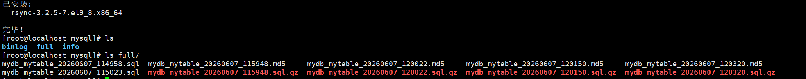

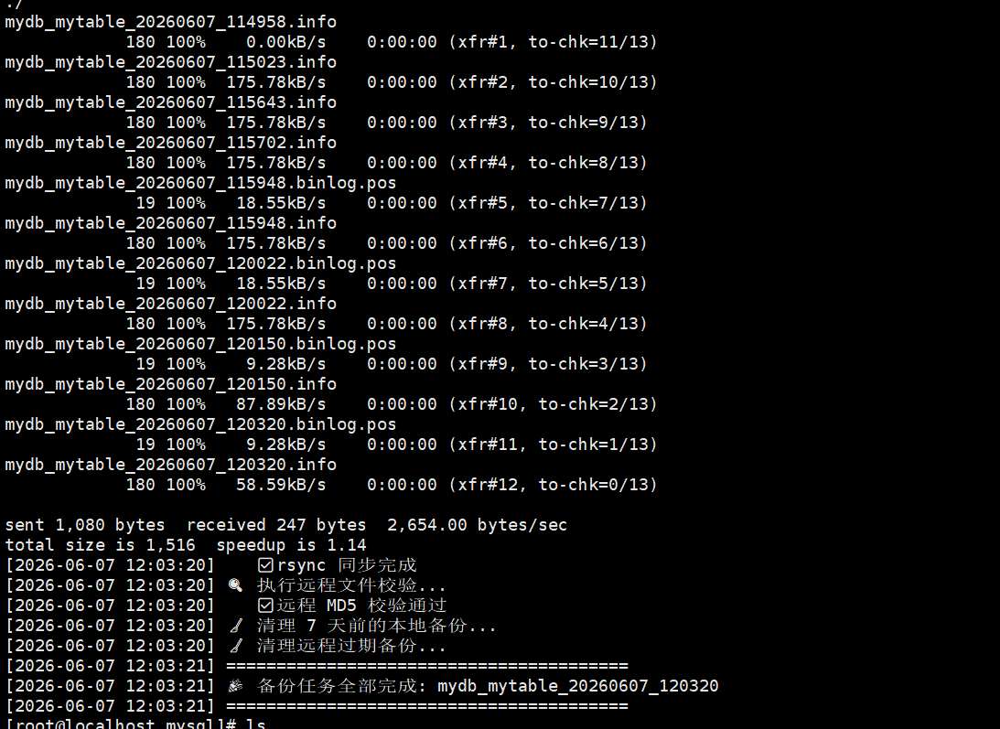

#### 三、定时配置（Crontab）

```
# 编辑定时任务
crontab -e

# 每天凌晨 2:00 执行全量备份
0 2 * * * /usr/local/bin/mysql_hot_backup.sh >> /var/log/backup/cron.log 2>&1
```

#### 四、恢复流程

##### 1. 全量恢复

```
# 解压并恢复
zcat /data/backup/mysql/full/mydb_mytable_20260606_020000.sql.gz | \
    mysql -uroot -p mydb
```

##### 2. Point-in-Time 恢复（结合 Binlog）

```
# 查看备份时的 binlog 位置
cat /data/backup/mysql/info/mydb_mytable_20260606_020000.info

# 先恢复全量
zcat mydb_mytable_xxxx.sql.gz | mysql -uroot -p mydb

# 再应用增量 binlog
mysqlbinlog \
    --start-position=xxxx \
    --stop-datetime="2026-06-06 12:00:00" \
    mysql-bin.0000xx mysql-bin.0000xx \
    | mysql -uroot -p mydb
```

## 第五部分

### 轻量级日志治理

| 节点     | IP             | 角色                                                         |
| :------- | :------------- | :----------------------------------------------------------- |
| **LB**   | 10.1.0.5 | Nginx **负载均衡** + **Loki + Grafana 服务端**               |
| **Web1** | 10.1.4.16 | LNMP + WordPress + MySQL 主 + NFS 服务端 + **Promtail 采集** |
| **Web2** | 192.168.19.133 | LNMP + WordPress + MySQL 从 + NFS 客户端 + **Promtail 采集** |

#### 一、LB 节点部署 Loki + Grafana（10.1.0.5）

##### 1. 添加 Grafana 仓库并安装

```
sudo dnf update -y

cat <<'EOF' | sudo tee /etc/yum.repos.d/grafana.repo
[grafana]
name=Grafana
baseurl=https://rpm.grafana.com
repo_gpgcheck=1
enabled=1
gpgcheck=1
gpgkey=https://rpm.grafana.com/gpg.key
sslverify=1
sslcacert=/etc/pki/tls/certs/ca-bundle.crt
EOF

sudo dnf install -y loki grafana
```

##### 2. 配置 Loki

```
sudo tee /etc/loki/config.yml <<'EOF'
auth_enabled: false

server:
  http_listen_port: 3100
  grpc_listen_port: 9095

common:
  path_prefix: /var/lib/loki
  storage:
    filesystem:
      chunks_directory: /var/lib/loki/chunks
      rules_directory: /var/lib/loki/rules
  replication_factor: 1
  ring:
    instance_addr: 127.0.0.1
    kvstore:
      store: inmemory

schema_config:
  configs:
    - from: 2024-01-01
      store: tsdb
      object_store: filesystem
      schema: v13
      index:
        prefix: index_
        period: 24h

limits_config:
  reject_old_samples: true
  reject_old_samples_max_age: 168h
  retention_period: 720h

compactor:
  working_directory: /var/lib/loki/compactor
  compaction_interval: 10m
  retention_enabled: true
  retention_delete_delay: 2h
  retention_delete_worker_count: 150
  delete_request_store: filesystem

ruler:
  alertmanager_url: http://localhost:9093
  ring:
    kvstore:
      store: inmemory
  rule_path: /tmp/loki/rules
  storage:
    type: local
    local:
      directory: /etc/loki/rules
EOF

sudo mkdir -p /var/lib/loki/compactor /var/lib/loki/chunks /var/lib/loki/rules /etc/loki/rules
sudo chown -R loki:loki /var/lib/loki

sudo systemctl restart loki
sudo systemctl status loki --no-pager
```

##### 3. 配置告警规则

```
sudo tee /etc/loki/rules/nginx.yml <<'EOF'
groups:
  - name: nginx_alerts
    rules:
      - alert: NginxHigh5xxRate
        expr: |
          sum(rate({job="nginx", log_type="access"} | json | status="5.."[1m])) by (host)
          /
          sum(rate({job="nginx", log_type="access"}[1m])) by (host) > 0.05
        for: 2m
        labels:
          severity: critical
        annotations:
          summary: "Nginx 5xx 率过高 {{ $labels.host }}"
          description: "主机 {{ $labels.host }} 5xx 错误率超过 5%"

      - alert: NginxSlowRequest
        expr: |
          sum(rate({job="nginx", log_type="access"} | json | request_time > 1[1m])) by (host)
          /
          sum(rate({job="nginx", log_type="access"}[1m])) by (host) > 0.1
        for: 3m
        labels:
          severity: warning
        annotations:
          summary: "Nginx 慢请求过多 {{ $labels.host }}"
          description: "主机 {{ $labels.host }} 响应时间>1s 的请求占比超过 10%"

      - alert: WordPressPHPError
        expr: |
          sum(rate({job="wordpress"} |= "PHP Fatal error"[1m])) by (host) > 0
        for: 1m
        labels:
          severity: warning
        annotations:
          summary: "WordPress PHP 致命错误 {{ $labels.host }}"
EOF
```

##### 验证

```
curl -s http://localhost:3100/ready
```

#### 二、Web1/Web2 部署 Promtail（10.1.4.16 / 192.168.19.133）

### 10.1.4.16

#### 1. 安装 Promtail

```
sudo dnf update -y

cat <<'EOF' | sudo tee /etc/yum.repos.d/grafana.repo
[grafana]
name=Grafana
baseurl=https://rpm.grafana.com
repo_gpgcheck=1
enabled=1
gpgcheck=1
gpgkey=https://rpm.grafana.com/gpg.key
sslverify=1
sslcacert=/etc/pki/tls/certs/ca-bundle.crt
EOF

sudo dnf install -y promtail
```

#### 2. 配置 Promtail

```
sudo tee /etc/promtail/config.yml <<'EOF'
server:
  http_listen_port: 9080
  grpc_listen_port: 0

positions:
  filename: /var/lib/promtail/positions.yaml

clients:
  - url: http://10.1.0.5:3100/loki/api/v1/push

scrape_configs:
  # Nginx 访问日志（JSON 格式）
  - job_name: nginx_access
    static_configs:
      - targets:
          - localhost
        labels:
          job: nginx
          log_type: access
          host: web1
          __path__: /var/log/nginx/access.log

    pipeline_stages:
      - json:
          expressions:
            remote_addr: remote_addr
            status: status
            request_uri: request_uri
            request_method: request_method
            request_time: request_time
            http_user_agent: http_user_agent
            http_x_forwarded_for: http_x_forwarded_for
      - labels:
          status:
          request_method:
      - timestamp:
          source: time_local
          format: '02/Jan/2006:15:04:05 -0700'

  # Nginx 错误日志
  - job_name: nginx_error
    static_configs:
      - targets:
          - localhost
        labels:
          job: nginx
          log_type: error
          host: web1
          __path__: /var/log/nginx/error.log

  # WordPress 日志（/data/wordpress 目录下）
  - job_name: wordpress
    static_configs:
      - targets:
          - localhost
        labels:
          job: wordpress
          host: web1
          __path__: /data/wordpress/wp-content/debug.log

    pipeline_stages:
      - regex:
          expression: '^\[(?P<<time>[^\]]+)\] (?P<<level>\w+): (?P<message>.*)$'
      - labels:
          level:
      - timestamp:
          source: time
          format: 'd-M-Y H:i:s'

  # PHP-FPM 慢日志
  - job_name: php_fpm_slow
    static_configs:
      - targets:
          - localhost
        labels:
          job: php_fpm
          host: web1
          __path__: /var/log/php-fpm/slow.log

  # PHP-FPM 错误日志
  - job_name: php_fpm_error
    static_configs:
      - targets:
          - localhost
        labels:
          job: php_fpm
          log_type: error
          host: web1
          __path__: /var/log/php-fpm/error.log
EOF

sudo mkdir -p /var/lib/promtail
sudo chown -R promtail:promtail /var/lib/promtail

sudo systemctl daemon-reload
sudo systemctl enable --now promtail
```

### 192.168.19.133

#### 1. 安装（同上）

#### 2. 配置 Promtail（host 改为 web2）

```
sudo tee /etc/promtail/config.yml <<'EOF'
server:
  http_listen_port: 9080
  grpc_listen_port: 0

positions:
  filename: /var/lib/promtail/positions.yaml

clients:
  - url: http://10.1.0.5:3100/loki/api/v1/push

scrape_configs:
  - job_name: nginx_access
    static_configs:
      - targets:
          - localhost
        labels:
          job: nginx
          log_type: access
          host: web2
          __path__: /var/log/nginx/access.log

    pipeline_stages:
      - json:
          expressions:
            remote_addr: remote_addr
            status: status
            request_uri: request_uri
            request_method: request_method
            request_time: request_time
            http_user_agent: http_user_agent
            http_x_forwarded_for: http_x_forwarded_for
      - labels:
          status:
          request_method:
      - timestamp:
          source: time_local
          format: '02/Jan/2006:15:04:05 -0700'

  - job_name: nginx_error
    static_configs:
      - targets:
          - localhost
        labels:
          job: nginx
          log_type: error
          host: web2
          __path__: /var/log/nginx/error.log

  - job_name: wordpress
    static_configs:
      - targets:
          - localhost
        labels:
          job: wordpress
          host: web2
          __path__: /data/wordpress/wp-content/debug.log

    pipeline_stages:
      - regex:
          expression: '^\[(?P<<time>[^\]]+)\] (?P<<level>\w+): (?P<message>.*)$'
      - labels:
          level:
      - timestamp:
          source: time
          format: 'd-M-Y H:i:s'

  - job_name: php_fpm_slow
    static_configs:
      - targets:
          - localhost
        labels:
          job: php_fpm
          host: web2
          __path__: /var/log/php-fpm/slow.log

  - job_name: php_fpm_error
    static_configs:
      - targets:
          - localhost
        labels:
          job: php_fpm
          log_type: error
          host: web2
          __path__: /var/log/php-fpm/error.log
EOF

sudo mkdir -p /var/lib/promtail
sudo chown -R promtail:promtail /var/lib/promtail

sudo systemctl daemon-reload
sudo systemctl enable --now promtail
```

#### 三、Nginx 日志 JSON 格式配置（Web1/Web2）

```
cat > /etc/nginx/nginx.conf <<'EOF'
# For more information on configuration, see:
#   * Official English Documentation: http://nginx.org/en/docs/
#   * Official Russian Documentation: http://nginx.org/ru/docs/

user nginx;
worker_processes auto;
error_log /var/log/nginx/error.log;
pid /run/nginx.pid;

# Load dynamic modules. See /usr/share/doc/nginx/README.dynamic.
include /usr/share/nginx/modules/*.conf;

events {
    worker_connections 1024;
}

http {
    log_format  main  '$remote_addr - $remote_user [$time_local] "$request" '
                      '$status $body_bytes_sent "$http_referer" '
                      '"$http_user_agent" "$http_x_forwarded_for"';

    log_format json_analytics escape=json '{"time_local":"$time_local","remote_addr":"$remote_addr","remote_user":"$remote_user","request":"$request","status":"$status","body_bytes_sent":"$body_bytes_sent","request_time":"$request_time","http_referrer":"$http_referer","http_user_agent":"$http_user_agent","http_x_forwarded_for":"$http_x_forwarded_for","server_name":"$server_name","upstream_response_time":"$upstream_response_time"}';

    access_log /var/log/nginx/access.log json_analytics;

    sendfile            on;
    tcp_nopush          on;
    tcp_nodelay         on;
    keepalive_timeout   65;
    types_hash_max_size 4096;

    include             /etc/nginx/mime.types;
    default_type        application/octet-stream;

    # Load modular configuration files from the /etc/nginx/conf.d directory.
    include /etc/nginx/conf.d/*.conf;

    server {
        listen       80;
        listen       [::]:80;
        server_name  _;
        root         /usr/share/nginx/html;

        # Load configuration files for the default server block.
        include /etc/nginx/default.d/*.conf;

        error_page 404 /404.html;
        location = /404.html {
        }

        error_page 500 502 503 504 /50x.html;
        location = /50x.html {
        }
    }
}
EOF

# 3. 测试并重载
nginx -t && systemctl reload nginx
```

#### 四、WordPress 调试日志启用（Web1/Web2）

```
# 编辑 /data/wordpress/wp-config.php 添加调试配置
sudo tee -a /data/wordpress/wp-config.php <<'EOF'

// 启用调试日志
define('WP_DEBUG', true);
define('WP_DEBUG_LOG', true);
define('WP_DEBUG_DISPLAY', false);
EOF

sudo touch /data/wordpress/wp-content/debug.log
sudo chown apache:apache /data/wordpress/wp-content/debug.log
sudo chmod 644 /data/wordpress/wp-content/debug.log
```

#### 五、Grafana 配置

### 1. 访问 Grafana

浏览器打开 `http://10.1.0.5:3000`，默认账号 `admin/admin`

### 2. 添加 Loki 数据源

- **Configuration → Data Sources → Add data source**
- 选择 **Loki**
- URL: `http://localhost:3100`
- **Save & Test**

#### 六、常用 LogQL 查询

```
# 查看所有 Nginx 访问日志
{job="nginx", log_type="access"}

# 查看 5xx 错误
{job="nginx", log_type="access"} | json | status="5.."

# 查看 4xx 错误按主机分布
{job="nginx", log_type="access"} | json | status="4.." | line_format "{{.host}} - {{.status}} - {{.request_uri}}"

# 查看慢请求 (>1s)
{job="nginx", log_type="access"} | json | request_time > 1

# 查看特定主机日志
{job="nginx", host="web1"}

# 统计每分钟 5xx 数量
sum(rate({job="nginx", log_type="access"} | json | status="5.."[1m])) by (host)

# WordPress PHP 错误
{job="wordpress"} |= "PHP Fatal error"

# WordPress 警告
{job="wordpress"} |= "PHP Warning"

# 查看 PHP-FPM 慢日志
{job="php_fpm"} |= "slow"
```

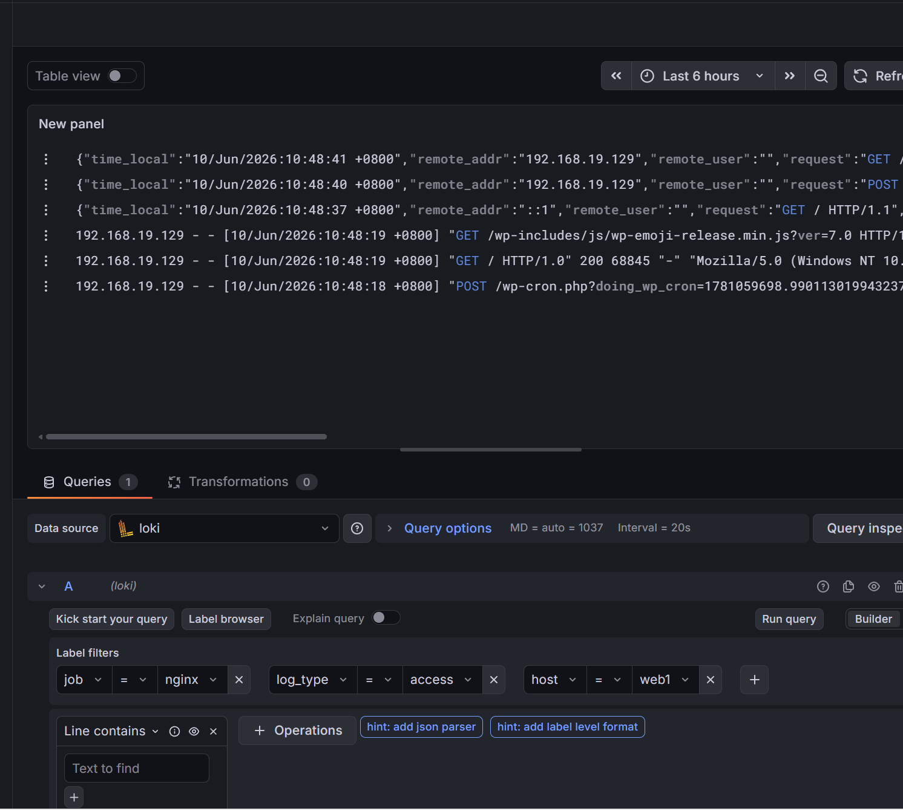

## 第六部分

### 部署 Zabbix 监控系统

| 节点     | IP             | Zabbix 角色           | 监控内容                               |
| :------- | :------------- | :-------------------- | :------------------------------------- |
| **LB**   | 10.1.0.5 | Zabbix Server + Agent | Nginx 活动连接、系统指标               |
| **Web1** | 10.1.4.16 | Zabbix Agent          | Nginx、MySQL 主库、WordPress、系统指标 |
| **Web2** | 192.168.19.133 | Zabbix Agent          | Nginx、MySQL 从库、WordPress、系统指标 |

#### 一、Zabbix Server 部署（LB 节点 10.1.0.5）

##### 1. 安装 Zabbix 仓库

```
sudo dnf update -y

# 添加 Zabbix 7.0 仓库（推荐用阿里云镜像加速）
sudo rpm -Uvh https://repo.zabbix.com/zabbix/7.0/rocky/9/x86_64/zabbix-release-7.0-5.el9.noarch.rpm

# 替换为阿里云镜像（可选，网络慢时建议）
sudo sed -i 's|repo.zabbix.com|mirrors.aliyun.com/zabbix|g' /etc/yum.repos.d/zabbix.repo
sudo sed -i 's|zabbix/7.0/rocky|zabbix/7.0/rhel|g' /etc/yum.repos.d/zabbix.repo

sudo dnf clean all
```

##### 2. 安装 Zabbix Server + Web + Agent

```
sudo dnf install -y zabbix-server-mysql zabbix-web-mysql zabbix-nginx-conf \
    zabbix-sql-scripts zabbix-selinux-policy zabbix-agent 
```

##### 3. 配置 MySQL

```
# 创建 Zabbix 数据库和用户
sudo mysql -uroot -p <<'EOF'
CREATE DATABASE zabbix CHARACTER SET utf8mb4 COLLATE utf8mb4_bin;
CREATE USER zabbix@localhost IDENTIFIED BY 'zabbix_pwd123';
GRANT ALL PRIVILEGES ON zabbix.* TO zabbix@localhost;
SET GLOBAL log_bin_trust_function_creators = 1;
EXIT;
EOF

# 导入初始数据（需要几分钟）
sudo zcat /usr/share/zabbix-sql-scripts/mysql/server.sql.gz | \
    mysql --default-character-set=utf8mb4 -uzabbix -pzabbix_pwd123 zabbix

# 导入完成后关闭
sudo mysql -uroot -p -e "SET GLOBAL log_bin_trust_function_creators = 0;"
```

##### 4. 配置 Zabbix Server

```
sudo tee /etc/zabbix/zabbix_server.conf <<'EOF'
DBHost=localhost
DBName=zabbix
DBUser=zabbix
DBPassword=zabbix_pwd123
ListenPort=10051
LogFile=/var/log/zabbix/zabbix_server.log
PidFile=/run/zabbix/zabbix_server.pid
SocketDir=/run/zabbix
SNMPTrapperFile=/var/log/snmptrap/snmptrap.log
Timeout=4
FpingLocation=/usr/sbin/fping
Fping6Location=/usr/sbin/fping6
LogSlowQueries=3000
StatsAllowedIP=127.0.0.1
EOF
```

##### 5. 配置 Zabbix Web（Nginx）

```
sudo tee /etc/nginx/conf.d/zabbix.conf <<'EOF'
server {
    listen 8080;
    server_name _;
    root /usr/share/zabbix;
    index index.php;

    location / {
        try_files $uri $uri/ =404;
    }

    location ~ \.php$ {
        fastcgi_pass unix:/run/php-fpm/zabbix.sock;
        fastcgi_index index.php;
        fastcgi_param SCRIPT_FILENAME $document_root$fastcgi_script_name;
        include fastcgi_params;
    }
}
EOF

# 配置 PHP 时区
sudo sed -i 's/;date.timezone =/date.timezone = Asia\/Shanghai/' /etc/php.ini
sudo sed -i 's/;date.timezone =/date.timezone = Asia\/Shanghai/' /etc/php-fpm.d/zabbix.conf
```

##### 6. 启动服务并放行防火墙

```
sudo systemctl enable --now zabbix-server zabbix-agent nginx php-fpm mariadb

sudo firewall-cmd --permanent --add-port=10051/tcp
sudo firewall-cmd --permanent --add-port=8080/tcp
sudo firewall-cmd --permanent --add-port=10050/tcp
sudo firewall-cmd --reload
```

##### 7. 访问 Zabbix Web 完成初始化

浏览器打开 `http://10.1.0.5:8080`

默认登录：`Admin` / `zabbix`

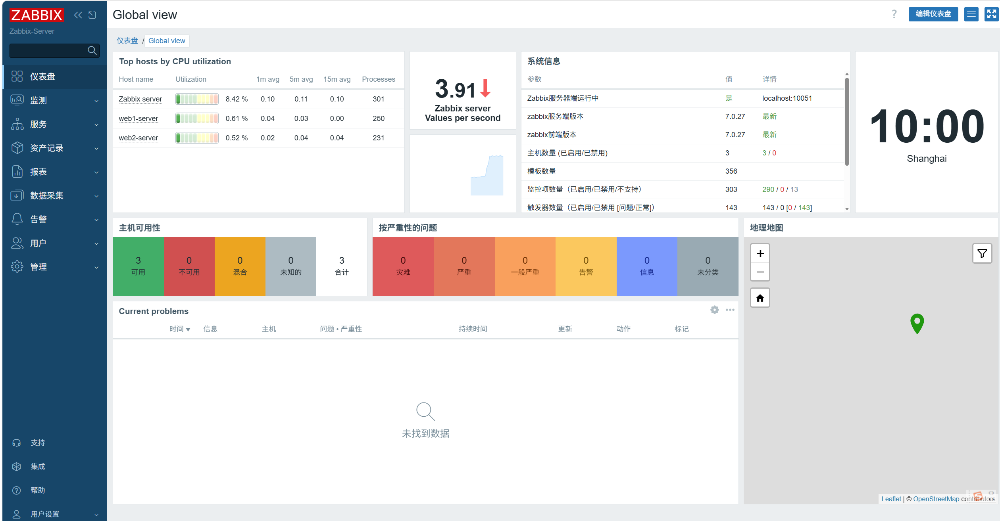

#### 二、Web1/Web2 部署 Zabbix Agent

##### 1. 安装 Agent

```
sudo dnf update -y
sudo rpm -Uvh https://repo.zabbix.com/zabbix/7.0/rocky/9/x86_64/zabbix-release-7.0-5.el9.noarch.rpm
sudo dnf clean all
sudo dnf install -y zabbix-agent2
```

##### 2. 配置 Agent

**Web1 (10.1.4.16)**：

```
sudo tee /etc/zabbix/zabbix_agent2.conf <<'EOF'
PidFile=/run/zabbix/zabbix_agent2.pid
LogFile=/var/log/zabbix/zabbix_agent2.log
LogFileSize=0
Server=10.1.0.5
ServerActive=10.1.0.5
Hostname=web1-server
Include=/etc/zabbix/zabbix_agent2.d/*.conf
UnsafeUserParameters=1
AllowKey=system.run[*]
EOF
```

**Web2 (192.168.19.133)**：

```
sudo tee /etc/zabbix/zabbix_agent2.conf <<'EOF'
PidFile=/run/zabbix/zabbix_agent2.pid
LogFile=/var/log/zabbix/zabbix_agent2.log
LogFileSize=0
Server=10.1.0.5
ServerActive=10.1.0.5
Hostname=web2-server
Include=/etc/zabbix/zabbix_agent2.d/*.conf
UnsafeUserParameters=1
AllowKey=system.run[*]
EOF
```

##### 3. 启动 Agent

```
sudo systemctl enable --now zabbix-agent2

sudo firewall-cmd --permanent --add-port=10050/tcp
sudo firewall-cmd --reload
```

#### 三、Nginx 活动连接监控（自定义脚本）

##### 1. 配置 Nginx stub_status（三台节点都执行）

```
# 在 nginx.conf 的 server 块中添加
sudo tee /etc/nginx/conf.d/status.conf <<'EOF'
server {
    listen 127.0.0.1:80;
    server_name localhost;

    location /nginx_status {
        stub_status on;
        access_log off;
        allow 127.0.0.1;
        deny all;
    }
}
EOF

sudo nginx -t && sudo systemctl reload nginx

# 测试
curl -s http://127.0.0.1/nginx_status
```

##### 2. 编写监控脚本（三台节点都执行）

```
sudo mkdir -p /etc/zabbix/scripts
sudo tee /etc/zabbix/scripts/nginx_status.sh <<'EOF'
#!/bin/bash
# Nginx 状态监控脚本

NGINX_STATUS="http://127.0.0.1/nginx_status"

case $1 in
    active)
        curl -s $NGINX_STATUS | grep "Active connections" | awk '{print $3}'
        ;;
    accepts)
        curl -s $NGINX_STATUS | awk NR==3 | awk '{print $1}'
        ;;
    handled)
        curl -s $NGINX_STATUS | awk NR==3 | awk '{print $2}'
        ;;
    requests)
        curl -s $NGINX_STATUS | awk NR==3 | awk '{print $3}'
        ;;
    reading)
        curl -s $NGINX_STATUS | grep "Reading" | awk '{print $2}'
        ;;
    writing)
        curl -s $NGINX_STATUS | grep "Writing" | awk '{print $4}'
        ;;
    waiting)
        curl -s $NGINX_STATUS | grep "Waiting" | awk '{print $6}'
        ;;
    *)
        echo "Usage: $0 {active|accepts|handled|requests|reading|writing|waiting}"
        exit 1
        ;;
esac
EOF

sudo chmod +x /etc/zabbix/scripts/nginx_status.sh
```

##### 3. 配置 UserParameter（三台节点都执行）

```
sudo tee /etc/zabbix/zabbix_agent2.d/nginx.conf <<'EOF'
UserParameter=nginx.active,/etc/zabbix/scripts/nginx_status.sh active
UserParameter=nginx.accepts,/etc/zabbix/scripts/nginx_status.sh accepts
UserParameter=nginx.handled,/etc/zabbix/scripts/nginx_status.sh handled
UserParameter=nginx.requests,/etc/zabbix/scripts/nginx_status.sh requests
UserParameter=nginx.reading,/etc/zabbix/scripts/nginx_status.sh reading
UserParameter=nginx.writing,/etc/zabbix/scripts/nginx_status.sh writing
UserParameter=nginx.waiting,/etc/zabbix/scripts/nginx_status.sh waiting
EOF

sudo systemctl restart zabbix-agent2
```

##### 4. 在 Zabbix Server 测试

```
# 安装 zabbix-get
sudo dnf install -y zabbix-get

# 测试获取数据
zabbix_get -s 10.1.4.16 -k nginx.active
zabbix_get -s 10.1.4.16 -k nginx.reading
zabbix_get -s 192.168.19.133 -k nginx.active
```


#### 四、MySQL 主从延迟监控（自定义脚本）

##### 1. 创建监控用户（Web1 主库执行）

```
sudo mysql -uroot -p <<'EOF'
CREATE USER 'zabbix_monitor'@'localhost' IDENTIFIED BY 'monitor_pwd123';
GRANT REPLICATION CLIENT, PROCESS, SHOW DATABASES ON *.* TO 'zabbix_monitor'@'localhost';
FLUSH PRIVILEGES;
EOF
```

##### 2. 编写监控脚本（Web2 从库执行）

```
sudo tee /etc/zabbix/scripts/mysql_slave_status.sh <<'EOF'
#!/bin/bash
# MySQL 主从状态监控脚本

MYSQL_USER="zabbix_monitor"
MYSQL_PASS="monitor_pwd123"

case $1 in
    io_running)
        mysql -u$MYSQL_USER -p$MYSQL_PASS -e "SHOW SLAVE STATUS\G" 2>/dev/null | grep "Slave_IO_Running" | awk '{print $2}'
        ;;
    sql_running)
        mysql -u$MYSQL_USER -p$MYSQL_PASS -e "SHOW SLAVE STATUS\G" 2>/dev/null | grep "Slave_SQL_Running" | awk '{print $2}'
        ;;
    delay)
        mysql -u$MYSQL_USER -p$MYSQL_PASS -e "SHOW SLAVE STATUS\G" 2>/dev/null | grep "Seconds_Behind_Master" | awk '{print $2}'
        ;;
    *)
        echo "Usage: $0 {io_running|sql_running|delay}"
        exit 1
        ;;
esac
EOF

sudo chmod +x /etc/zabbix/scripts/mysql_slave_status.sh
```

##### 3. 配置 UserParameter（Web2 执行）

```
sudo tee /etc/zabbix/zabbix_agent2.d/mysql_slave.conf <<'EOF'
UserParameter=mysql.slave_io_running,/etc/zabbix/scripts/mysql_slave_status.sh io_running
UserParameter=mysql.slave_sql_running,/etc/zabbix/scripts/mysql_slave_status.sh sql_running
UserParameter=mysql.slave_delay,/etc/zabbix/scripts/mysql_slave_status.sh delay
EOF

sudo systemctl restart zabbix-agent2
```

##### 4. 测试

```
zabbix_get -s 192.168.19.133 -k mysql.slave_delay
zabbix_get -s 192.168.19.133 -k mysql.slave_io_running
```


#### 五、Zabbix Web 配置监控项和触发器

##### 1. 添加主机

登录 Zabbix Web → **配置 → 主机 → 创建主机**

| 主机名      | 可见名称    | 群组          | Agent 接口           |
| :---------- | :---------- | :------------ | :------------------- |
| lb-server   | LB 负载均衡 | Linux servers | 10.1.0.5:10050 |
| web1-server | Web1 主库   | Linux servers | 10.1.4.16:10050 |
| web2-server | Web2 从库   | Linux servers | 192.168.19.133:10050 |

模板选择：** Linux by Zabbix agent**

##### 2. 创建 Nginx 监控模板

**配置 → 模板 → 创建模板**

- 模板名称：`Template App Nginx Status`
- 群组：`Templates`

**添加监控项：**

| 名称                     | 键值             | 类型         | 更新间隔 |
| :----------------------- | :--------------- | :----------- | :------- |
| Nginx Active Connections | `nginx.active`   | Zabbix agent | 30s      |
| Nginx Reading            | `nginx.reading`  | Zabbix agent | 30s      |
| Nginx Writing            | `nginx.writing`  | Zabbix agent | 30s      |
| Nginx Waiting            | `nginx.waiting`  | Zabbix agent | 30s      |
| Nginx Accepts            | `nginx.accepts`  | Zabbix agent | 60s      |
| Nginx Handled            | `nginx.handled`  | Zabbix agent | 60s      |
| Nginx Requests           | `nginx.requests` | Zabbix agent | 60s      |

**添加触发器（多级告警）：**

| 名称                         | 表达式                                                  | 严重程度 |
| :--------------------------- | :------------------------------------------------------ | :------- |
| Nginx 活动连接数过高（警告） | `{Template App Nginx Status:nginx.active.last()}>500`   | 警告     |
| Nginx 活动连接数过高（严重） | `{Template App Nginx Status:nginx.active.last()}>1000`  | 严重     |
| Nginx 活动连接数过高（灾难） | `{Template App Nginx Status:nginx.active.last()}>2000`  | 灾难     |
| Nginx 状态页不可访问         | `{Template App Nginx Status:nginx.active.nodata(60)}=1` | 严重     |

##### 3. 创建 MySQL 主从监控模板

**配置 → 模板 → 创建模板**

- 模板名称：`Template MySQL Replication`
- 群组：`Templates`

**添加监控项：**

| 名称                    | 键值                      | 类型         | 更新间隔 |
| :---------------------- | :------------------------ | :----------- | :------- |
| MySQL Slave IO Running  | `mysql.slave_io_running`  | Zabbix agent | 30s      |
| MySQL Slave SQL Running | `mysql.slave_sql_running` | Zabbix agent | 30s      |
| MySQL Slave Delay       | `mysql.slave_delay`       | Zabbix agent | 30s      |

**添加触发器（多级告警）：**

| 名称                          | 正确表达式                                                   | 严重程度 |
| :---------------------------- | :----------------------------------------------------------- | :------- |
| MySQL 主从复制 IO 线程停止    | `last(/Template MySQL Replication/mysql.slave_io_running)<>"Yes"` | 灾难     |
| MySQL 主从复制 SQL 线程停止   | `last(/Template MySQL Replication/mysql.slave_sql_running)<>"Yes"` | 灾难     |
| MySQL 主从延迟 > 10s（警告）  | `last(/Template MySQL Replication/mysql.slave_delay)>10`     | 警告     |
| MySQL 主从延迟 > 60s（严重）  | `last(/Template MySQL Replication/mysql.slave_delay)>60`     | 严重     |
| MySQL 主从延迟 > 300s（灾难） | `last(/Template MySQL Replication/mysql.slave_delay)>300`    | 灾难     |

##### 4. 绑定模板到主机

- **lb-server / web1-server / web2-server**：绑定 `Template App Nginx Status`
- **web2-server**：额外绑定 `Template MySQL Replication`

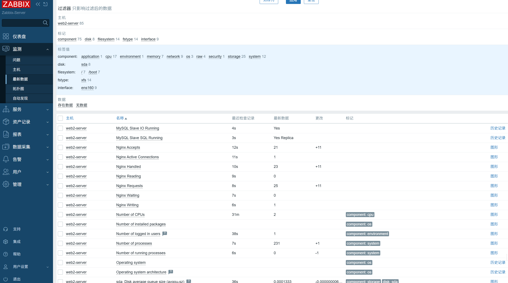

#### 六、配置告警通知

##### 1. 配置邮件告警

**管理 → 报警媒介类型 → Email**

| 参数        | 值                     |
| :---------- | :--------------------- |
| SMTP 服务器 | smtp.qq.com            |
| SMTP 端口   | 465                    |
| SMTP HELO   | qq.com                 |
| SMTP 电邮   | <your_email@qq.com>    |
| 认证        | 用户名和密码           |
| 用户名      | <your_email@qq.com>    |
| 密码        | 授权码（不是邮箱密码） |

##### 2. 配置用户告警媒介

**管理 → 用户 → Admin → 报警媒介**

- 类型：Email
- 收件人：[your_email@qq.com](mailto:your_email@qq.com)
- 启用：是

##### 3. 配置动作（告警策略）

**配置 → 动作 → 创建动作**

**动作名称：** Nginx & MySQL 告警

**条件：**

- 触发器示警度 >= 警告
- 主机群组 = Linux servers

**操作：**

| 步骤 | 操作                                    | 持续时间               |
| :--- | :-------------------------------------- | :--------------------- |
| 1    | 发送消息给用户组：Zabbix administrators | 立即                   |
| 2    | 发送消息给用户组：Zabbix administrators | 5分钟后（如果未恢复）  |
| 3    | 发送消息给用户组：Zabbix administrators | 10分钟后（如果未恢复） |

**恢复操作：**

- 发送恢复消息给用户组：Zabbix administrators


#### 七、验证监控效果

##### 1. 查看最新数据

**监测 → 最新数据**

选择主机，查看 Nginx 和 MySQL 监控项的实时值。

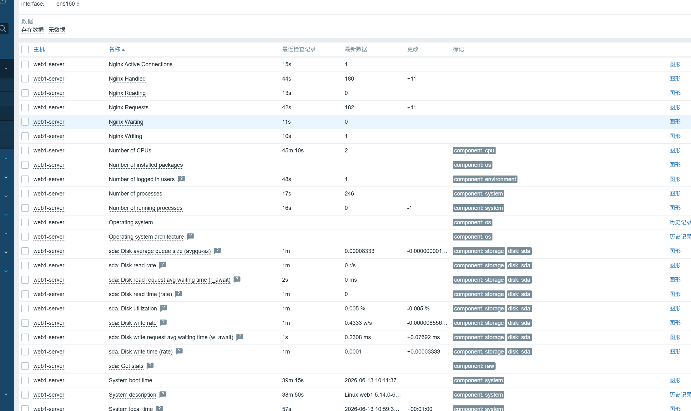

#### 2. 模拟告警测试

```
# Web2 上模拟主从延迟（临时停止 SQL 线程）
sudo mysql -uroot -p -e "STOP SLAVE SQL_THREAD;"

# 观察 Zabbix 告警（约 30 秒内触发）

# 恢复
sudo mysql -uroot -p -e "START SLAVE SQL_THREAD;"
```


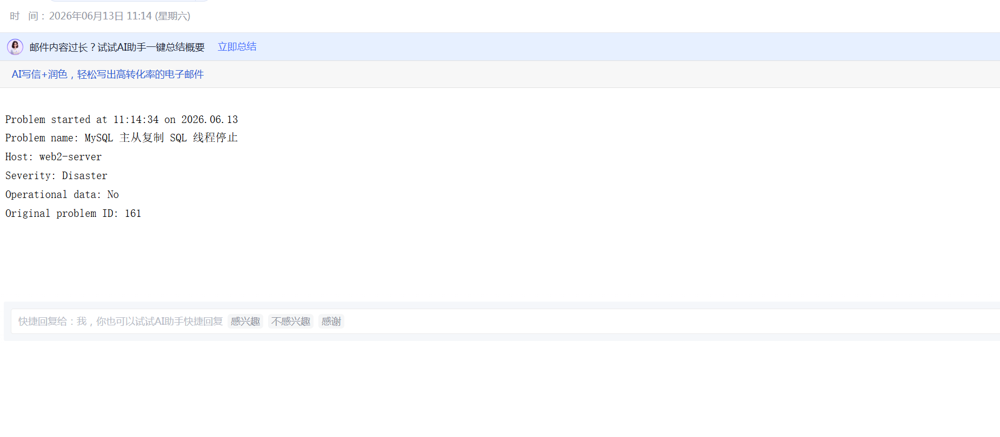
